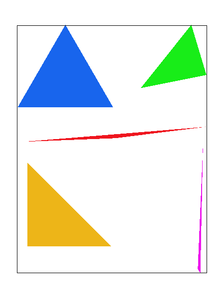
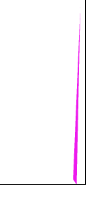

# Task 2: Antialiasing by Supersampling

## Method
In task 2, antialiasing is implemented by supersampling and downsampling. Main steps involves:

- **Creating and maintaining sample buffer**: To store the supersampling result, a sample buffer corresponding to the sample rate is created and managed throughout the render pipeline. When sample rate updates, the sample buffer should be updated accordingly.

- **Supersampling with sample buffer**: Sampling the triangle implements the sample buffer with the same method as in task 1 except the vertice position of triangle should be transformed to the sample buffer coordinate. However, lines and points should not be antialiased. They need to be zoomed by the sample rate before populating the sample buffer.

- **Downsampling and populating frame buffer**: Downsampling the sample buffer to the frame buffer by mixing the color of the samples corresponding to the same pixel.

## Implementation
### Creating and maintaining sample buffer
When the sample rate is updated, sample buffer should be resized. As `RasterizerImp::set_sample_rate` updates sample rate, buffer is resized when the function is called:

```cpp
  void RasterizerImp::set_sample_rate(unsigned int rate)
  {
    // TODO: Task 2: You may want to update this function for supersampling support

    this->sample_rate = rate;

    // updated for supersampling
    this->sample_buffer.resize(width * height * sample_rate, Color::White);
  }
```

The same applies to `RasterizerImp::set_framebuffer_target`:

```cpp
  void RasterizerImp::set_framebuffer_target(unsigned char *rgb_framebuffer,
                                             size_t width, size_t height)
  {
    // TODO: Task 2: You may want to update this function for supersampling support

    //cout << "set_framebuffer_target" << endl;

    this->width = width;
    this->height = height;
    this->rgb_framebuffer_target = rgb_framebuffer;

    //updated for supersampling
    this->sample_buffer.resize(width * height * sample_rate, Color::White);
  }
```

### Supersampling with sample buffer
Define $zoom\_coefficient = \sqrt{sample\_rate}$, the transformation of the vertice position of triangle to the sample buffer coordinate is:

$$
(x_{transformed},y_{transformed}) = (x_{original},y_{original}) \times zoom\_coefficient
$$

```cpp
    // Step 1: Convert the triangle vertices to the supersample buffer's coordinate system
    int zoom_coefficient = sqrt(sample_rate);
    float x0_ss = x0 * zoom_coefficient;
    float y0_ss = y0 * zoom_coefficient;
    float x1_ss = x1 * zoom_coefficient;
    float y1_ss = y1 * zoom_coefficient;
    float x2_ss = x2 * zoom_coefficient;
    float y2_ss = y2 * zoom_coefficient;
```

The sampling process is exactly the same as in task 1, except the result fills sample buffer instead of frame buffer.

For lines and points, they fill directly to the frame buffer pixels. This can be achieved by filling all the subpixels in the sample buffer with the same color. These subpixels forms a square of size $zoom\_coefficient \times zoom\_coefficient$. A double loop is implement to iterate all the subpixels.

```cpp
  void RasterizerImp::fill_pixel(size_t x, size_t y, Color c)
  {
    // TODO: Task 2: You might need to this function to fix points and lines (such as the black rectangle border in test4.svg)
    // NOTE: You are not required to implement proper supersampling for points and lines
    // It is sufficient to use the same color for all supersamples of a pixel for points and lines (not triangles)

    // Implementation by Ruhao Tian starts here
    // As points and lines are not required to be supersampled, we can simply fill the corresponding buffer with given color
    int zoom_coefficient = sqrt(sample_rate);
    for (int i = 0; i < zoom_coefficient; i++)
    {
      for (int j = 0; j < zoom_coefficient; j++)
      {
        sample_buffer[(y * zoom_coefficient + j) * width * zoom_coefficient + x * zoom_coefficient + i] = c;
      }
    }
  }
```

### Downsampling and populating frame buffer
`RasterizerImp::resolve_to_framebuffer` resolves the sample buffer to the frame buffer. It iterate all the pixels in the frame buffer. For each pixel, its subpixel square is located. 

The R, G, B values of all subpixels are averaged respectively and assigned to a temporary `Color` object `ds_color`:

```cpp
        // for each pixel, calculate the average color of all the samples
        ds_color.r = 0;
        ds_color.g = 0;
        ds_color.b = 0;

        for (int i = 0; i < zoom_coefficient; i++)
        {
          for (int j = 0; j < zoom_coefficient; j++)
          {
            ds_color.r += sample_buffer[(y * zoom_coefficient + j) * width * zoom_coefficient + x * zoom_coefficient + i].r / (float)(sample_rate);
            ds_color.g += sample_buffer[(y * zoom_coefficient + j) * width * zoom_coefficient + x * zoom_coefficient + i].g / (float)(sample_rate);
            ds_color.b += sample_buffer[(y * zoom_coefficient + j) * width * zoom_coefficient + x * zoom_coefficient + i].b / (float)(sample_rate);
          }
        }
```

Then the convertion of `ds_color` to `rgb_framebuffer_target` is the same as base code:

```cpp
        for (int k = 0; k < 3; ++k)
        {
          this->rgb_framebuffer_target[3 * (y * width + x) + k] = (&ds_color.r)[k] * 255;
        }
```

The full implementation of `RasterizerImp::resolve_to_framebuffer` is:

```cpp
  void RasterizerImp::resolve_to_framebuffer()
  {
    // TODO: Task 2: You will likely want to update this function for supersampling support

    // Implementation by Ruhao Tian starts here

    //cout << "resolve_to_framebuffer" << endl;

    int zoom_coefficient = sqrt(sample_rate);
    Color ds_color(0, 0, 0);

    for (int x = 0; x < width; ++x)
    {
      for (int y = 0; y < height; ++y)
      {
        // for each pixel, calculate the average color of all the samples
        ds_color.r = 0;
        ds_color.g = 0;
        ds_color.b = 0;

        for (int i = 0; i < zoom_coefficient; i++)
        {
          for (int j = 0; j < zoom_coefficient; j++)
          {
            ds_color.r += sample_buffer[(y * zoom_coefficient + j) * width * zoom_coefficient + x * zoom_coefficient + i].r / (float)(sample_rate);
            ds_color.g += sample_buffer[(y * zoom_coefficient + j) * width * zoom_coefficient + x * zoom_coefficient + i].g / (float)(sample_rate);
            ds_color.b += sample_buffer[(y * zoom_coefficient + j) * width * zoom_coefficient + x * zoom_coefficient + i].b / (float)(sample_rate);
          }
        }

        for (int k = 0; k < 3; ++k)
        {
          this->rgb_framebuffer_target[3 * (y * width + x) + k] = (&ds_color.r)[k] * 255;
        }
      }
    }

    //cout << "resolve_to_framebuffer done" << endl;
  }
```

## Results
The following images are the result of supersampling `basic/test4.svg` with sample rate 1, 4 and 16.

!!! info "Image displayed size too small?"

    Click on the image to activate lightbox mode.
    In lightbox mode, click on the arrows on the left and right to navigate through images. This brings easy comparison.

{ width=32%\textwidth}
{ width=32%\textwidth}
{ width=32%\textwidth}

The following images shows a zoomed view of one triangle in `basic/test4.svg`. The left image is the result of sample rate 1 while the other one implements sample rate 16.

{ width=48%\textwidth}
{ width=48%\textwidth}

In the left image, the top of the triangle seemed 'disconnected' from the other part. This is because in the diconnected part all the nearby sample points(center of pixel) are outside the triangle. When the sample rate increases, the subpixels inside the triangle are identified. This comparison shows the effectiveness of supersampling in antialiasing--it not only smooths the edges but also corrects the display of the image.