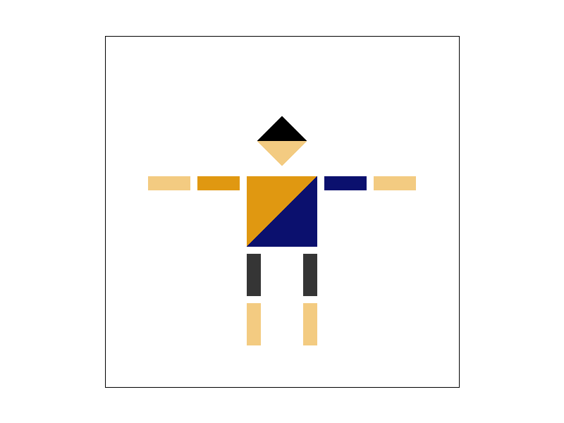
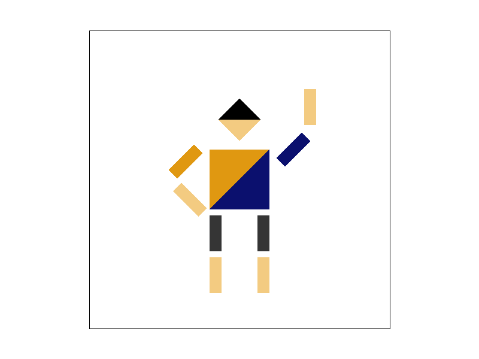

# Task 3: Transforms

## SVG Design
The overall idea is to design a robot with black hair, yellow skin, grey trousers and a T-shirt with Berkeley's iconic orange and blue color. The posture of robot is standing with right arm on the waist and left arm waving.

## Setting up colors
With the help of palette software, the RGB code of colors is obtained:

- :material-checkbox-blank-circle:{ style="color:#000000" } Black: #000000
- :material-checkbox-blank-circle:{ style="color:#f3cb81" } Yellow: #f3cb81
- :material-checkbox-blank-circle:{ style="color:#353535" } Grey: #353535
- :material-checkbox-blank-circle:{ style="color:#e09811" } Orange: #e09811
- :material-checkbox-blank-circle:{ style="color:#0b106e" } Blue: #0b106e

Filling the colors in the SVG file, the robot is rendered as follows:



## Transforms

The right arm of the robot is rotated by -45 degrees, the forearm is rotated by -90, and the relative position is slightly adjusted:(modifications are highlighted in the code below)

```xml linenums="51" hl_lines="2 7 8"
		<g transform="translate(-90 -30)">
			<g transform="rotate(-45)">
				<g transform="scale(.6 .2)">
					<polygon fill="#e09811" points="-50,-50 50,-50 -50,50 " />
					<polygon fill="#e09811" points="-50,50 50,-50 50,50" />
				</g>
				<g transform="translate(-40 50)">
					<g transform="rotate(-90)">
						<g transform="scale(.6 .2)">
							<polygon fill="#f3cb81" points="-50,-50 50,-50 -50,50 " />
							<polygon fill="#f3cb81" points="-50,50 50,-50 50,50" />
						</g>
					</g>
				</g>
			</g>
		</g>
```

The left big arm and forearm of the robot are rotated by -45 degrees, their relative position is adjusted as well:

```xml linenums="69" hl_lines="2 7 8"
		<g transform="translate(90 -50)">
			<g transform="rotate(-45)">
				<g transform="scale(.6 .2)">
					<polygon fill="#0b106e" points="-50,-50 50,-50 -50,50 " />
					<polygon fill="#0b106e" points="-50,50 50,-50 50,50" />
				</g>
				<g transform="translate(70 -30)">
					<g transform="rotate(-45)">
						<g transform="scale(.6 .2)">
							<polygon fill="#f3cb81" points="-50,-50 50,-50 -50,50 " />
							<polygon fill="#f3cb81" points="-50,50 50,-50 50,50" />
						</g>
					</g>
				</g>
			</g>
		</g>
```

The robot is rendered as follows:

