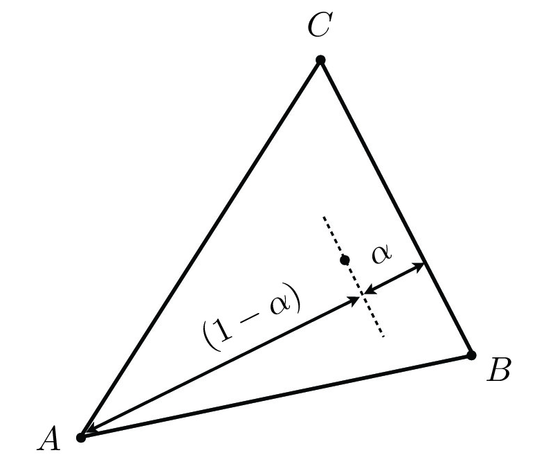
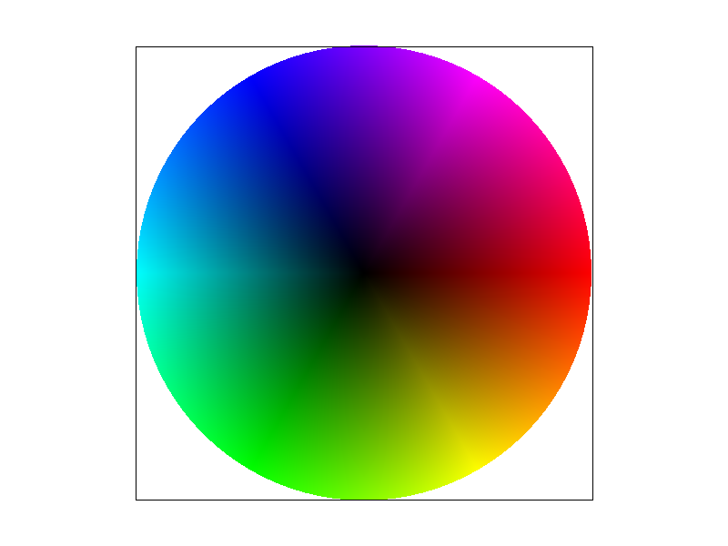

# Task 4: Barycentric coordinates

## Methodology

### The Barycentric Coordinate System

The barycentric coordinate present a point in a triangle with the weighted sum of the triangle's vertice postions. Assume triangle vertices $A(x_{A},y_{A})$, $B(x_{B},y_{B})$, and $C(x_{C},y_{C})$, position of any point $P(x_{P},y_{P})$ inside the triangle can be calculated as:

$$
P = \alpha A + \beta B + \gamma C
$$

where $\alpha + \beta + \gamma = 1$. In other words, $\alpha$, $\beta$ and $\gamma$ are the weights showing how much each vertex contributes or close to the point $P$.

### Calculation

One way to represent how close a point is to a vertex is to calculate its porportional distance to the edge opposite to the vertex, as is shown in the following figure:



Assume $D_{BC}$ to be the distance to edge $BC$, the $\alpha$ weight can be calculated as:

$$
\alpha = \frac{D_{BC}(x_{P},y_{P})}{D_{BC}(x_{A},y_{A})}
$$

Point-to-line distance formula can be used to calculate $D$:

$$
D_{BC}(x_{P},y_{P}) = -(x_{P} - x_{B})(y_{C} - y_{B}) + (y_{P} - y_{B})(x_{C} - x_{B})
$$

$$
D_{BC}(x_{A},y_{A}) = -(x_{A} - x_{B})(y_{C} - y_{B}) + (y_{A} - y_{B})(x_{C} - x_{B})
$$

Replace $D_{BC}$ in the $\alpha$ formula, we get:

$$
\alpha = \frac{-(x_{P} - x_{B})(y_{C} - y_{B}) + (y_{P} - y_{B})(x_{C} - x_{B})}{-(x_{A} - x_{B})(y_{C} - y_{B}) + (y_{A} - y_{B})(x_{C} - x_{B})}
$$

Similarly, $\beta$ and $\gamma$ can be calculated as:

$$
\beta = \frac{-(x_{P} - x_{C})(y_{A} - y_{C}) + (y_{P} - y_{C})(x_{A} - x_{C})}{-(x_{B} - x_{C})(y_{A} - y_{C}) + (y_{B} - y_{C})(x_{A} - x_{C})}
$$

$$
\gamma = \frac{-(x_{P} - x_{A})(y_{B} - y_{A}) + (y_{P} - y_{A})(x_{B} - x_{A})}{-(x_{C} - x_{A})(y_{B} - y_{A}) + (y_{C} - y_{A})(x_{B} - x_{A})}
$$

### Features of Barycentric Coordinates

The Barycentric coordinates' distinctive feature makes it suitable for geometric calculations in computer graphics. This includes but not limited to:

- **Interpolation**: Barycentric coordinates can be used to interpolate values smoothly varying across a triangle. This is useful in texture mapping, color blending, and shading.
- **Invariance to affine transformations**: Regardless of the affine transformation applied to the triangle, the relative position of the vertices remains the same. As Barycentric coordinates are based on the relative position of the vertices, it could simplify calculation when affine transformations are involved.

## Implementation
To determind whether a point is inside a triangle with Barycentric coordinates, whether the three weights are all positive is the only thing needed to check. For the points inside the triangle, its color is the weighted sum of the triangle's vertices' color, where the weights are excatly the Barycentric coordinates' weights. Other parts of the rasterization pocess are the same as Task 2.

The following code shows the rasterization process with Barycentric coordinates, highlighted are the parts where Barycentric coordinates are involved:

```cpp linenums="202" hl_lines="34 35 36 39 42"
    // Step 1: Convert the triangle vertices to the supersample buffer's coordinate system
    int zoom_coefficient = sqrt(sample_rate);
    float x0_ss = x0 * zoom_coefficient;
    float y0_ss = y0 * zoom_coefficient;
    float x1_ss = x1 * zoom_coefficient;
    float y1_ss = y1 * zoom_coefficient;
    float x2_ss = x2 * zoom_coefficient;
    float y2_ss = y2 * zoom_coefficient;

    // Step 2: Find the bounding box of the triangle in the supersample buffer
    int bounding_box_x_min = (int)floor(min(x0_ss, min(x1_ss, x2_ss)));
    int bounding_box_x_max = (int)ceil(max(x0_ss, max(x1_ss, x2_ss)));
    int bounding_box_y_min = (int)floor(min(y0_ss, min(y1_ss, y2_ss)));
    int bounding_box_y_max = (int)ceil(max(y0_ss, max(y1_ss, y2_ss)));

    // Step 3: Iterate through all the pixels in the bounding box

    //cout << "iterating through pixels in the bounding box" << endl;

    int current_x_position, current_y_position;
    float line01_delta_x = x1_ss - x0_ss;
    float line01_delta_y = y1_ss - y0_ss;
    float line12_delta_x = x2_ss - x1_ss;
    float line12_delta_y = y2_ss - y1_ss;
    float line20_delta_x = x0_ss - x2_ss;
    float line20_delta_y = y0_ss - y2_ss;
    float weight_0, weight_1, weight_2;
    Color current_color;
    for (current_y_position = bounding_box_y_min; current_y_position <= bounding_box_y_max; current_y_position++)
    {
      for (current_x_position = bounding_box_x_min; current_x_position <= bounding_box_x_max; current_x_position++)
      {
        // calcuate the weights of the barycentric coordinates
        weight_0 = (-(current_x_position + 0.5 - x1_ss) * line12_delta_y + (current_y_position + 0.5 - y1_ss) * line12_delta_x)/(-(x0_ss - x1_ss) * line12_delta_y + (y0_ss - y1_ss) * line12_delta_x);
        weight_1 = (-(current_x_position + 0.5 - x2_ss) * line20_delta_y + (current_y_position + 0.5 - y2_ss) * line20_delta_x)/(-(x1_ss - x2_ss) * line20_delta_y + (y1_ss - y2_ss) * line20_delta_x);
        weight_2 = (-(current_x_position + 0.5 - x0_ss) * line01_delta_y + (current_y_position + 0.5 - y0_ss) * line01_delta_x)/(-(x2_ss - x0_ss) * line01_delta_y + (y2_ss - y0_ss) * line01_delta_x);

        // check if the pixel is inside the triangle
        if (weight_0 >= 0. && weight_1 >= 0. && weight_2 >= 0.)
        {
          // if so, calculate the color of the pixel
          current_color = c0 * weight_0 + c1 * weight_1 + c2 * weight_2;

          // fill the corresponding buffer
          sample_buffer[current_y_position * width * zoom_coefficient + current_x_position] = current_color;
        }
      }
    }
```

## Results
The screenshot of `svg/basic/test7.svg` is shown below.

