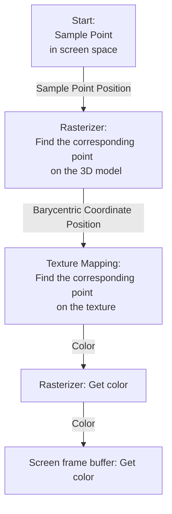
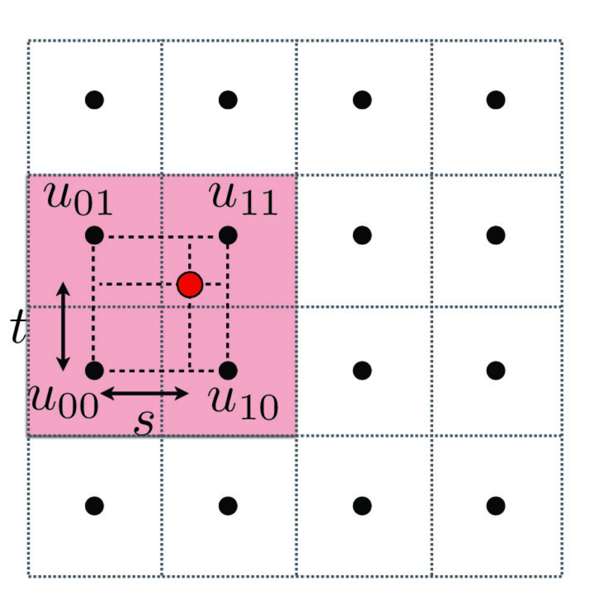

# Task 5: "Pixel sampling" for texture mapping

## Methodology

### Texture Coordinates Mapping

{ align=left }

Given an unfolded texture image and a 3D model, the mission is to 'wrap around' the texture onto the 3D model. During this process, the 2D texture image is divided into many triangles, each of which corresponds to a triangle on the 3D model. However, the 3D model has a different coordination system from the 2D image. Therefore, texture coordinates mapping is needed to map the 2D texture image to the 3D model.

As discussed in the previous task, the Barycentric coordinates remain the same however the triangle transforms affinely. Therefore, given a point on the 3D model, one can obtain its matching point on the 2D texture by finding out its Barycentric coordinates and then using the Barycentric coordinates to interpolate the texture coordinates. This lays the foundation for texture mapping.

### Pixel Sampling

Pixel sampling finds which color should be displayed on the screen pixel. First, the corresponding point on the 3D model of the pixel sample point is found, which is the job of the rasterizer. As the color of the triangle is decided by its texture, the next step is to find the corresponding color point on the texture. After that, the color is returned all the way back to the pixel point. This whole process is described in the following figure.



Featured by the density of sample points and texture texels, pixel sampling could be categorized into:

- **Magnification pixel sampling**: Where texels surplus sample points and each sample point corresponds to several texels. Common sample methods are nearest sampling and bilinear sampling.
- **Minification pixel sampling**: Where sample points surplus texels and each texel corresponds to several sample points. Common sample methods include mipmap and anisotropic filtering.

### Magnification pixel sampling

#### Nearest sampling

Nearest sampling choose the closest texel to the sample point. Simple idea, low computational complexity, but nearest sampling does not ensure the color of sample pixels will change smoothly, so aliasing is common for nearest sampling. 

#### Bilinear sampling

{ align=right width=30%\textwidth }

Bilinear sampling finds 4 closest texels around the sample point. Both horizontal and vertical interpolations are performed to get the final color. Assume $u_{00}$, $u_{01}$, $u_{10}$, $u_{11}$ are the for texels and $C$ is the color of texel, the first and second linear interpolation calculate the color of two groups of horizontal texels, based on the proportional distance horizontally sample point is close to the texels:


$$
C_{0} = (1 - s) \cdot C_{00} + s \cdot C_{10}
$$

$$
C_{1} = (1 - s) \cdot C_{01} + s \cdot C_{11}
$$

Then, the final color is calculated by the third linear interpolation, based on the proportional distance vertically sample point is close to the texels:

$$
C = (1 - t) \cdot C_{0} + t \cdot C_{1}
$$

Bilinear sampling is more complex than nearest sampling, but it can effectively reduce aliasing.

## Implementation

### Nearest sampling

The nearest texel of the sample point is exactly the texel sample point is in. Therefore, the position of the nearest texel is the integer part of the texture coordinates and can be easily calculated by `floor` function.

It is worth noting that, as mipmap size varies with the level, the input texture coordinates should be scaled to the mipmap size.

```cpp
  Color Texture::sample_nearest(Vector2D uv, int level) {
    // TODO: Task 5: Fill this in.
    auto& mip = mipmap[level];


    return mip.get_texel((int)floor(uv.x * mip.width), (int)floor(uv.y * mip.height));
  }
```

### Bilinear sampling

There is a special case for bilinear sampling: when the sample point is so close to the edge of the texture that the position of some closest texels is out of the texture. In this case, the closest texel inside texture is used to replace the out-of-bound texel. In implementation, the position of the out-of-bound texel could be replaced by the position of that closest texel. Take the horizontal direction as an example, the position of out-of-bound texel is replaced by the position of the closest texel inside the texture:

```cpp
    //find the x coordinate of four nearest texels, as well as the proportion of the distance
    // consider the edge case, if the sample point is on the edge, repeat the nearest texel
    if (uv_x <= 0.5)
    {
      sampletexel_lu[0] = 0;
      sampletexel_ru[0] = 0;
      sampletexel_ld[0] = 0;
      sampletexel_rd[0] = 0;
      // horizontally, the two nearest texels are the same
      x_proportion = 0; // could be any value
    }
    else if (uv_x >= width - 0.5)
    {
      sampletexel_lu[0] = width - 1;
      sampletexel_ru[0] = width - 1;
      sampletexel_ld[0] = width - 1;
      sampletexel_rd[0] = width - 1;
      
      x_proportion = 0;
    }
    else
    {
      sampletexel_lu[0] = floor(uv_x - 0.5);
      sampletexel_ru[0] = ceil(uv_x - 0.5);
      sampletexel_ld[0] = floor(uv_x - 0.5);
      sampletexel_rd[0] = ceil(uv_x - 0.5);

      x_proportion = (uv_x - 0.5) - floor(uv_x - 0.5);
    }
```

In the first two situations of `if` statement, because horizontally the two nearest texels are the same, their weighted color sum will always be the same, which means the proportion of the distance does not need to be calculated and this is why `x_proportion` is set to 0. In other cases, `floor(uv_x- 0.5)` gives the left two texels' x coordinates and this coordinate plus by one, equals `ceil(`uv_x - 0.5)`, giving the right ones. The same logic applies to the vertical direction.

After obtaining the position of the four nearest texels and the proportion of the distance, the color of the sample point is calculated by the formula mentioned above.

```cpp
    //get the color of four nearest texels
    c_lu = mip.get_texel((int)sampletexel_lu[0], (int)sampletexel_lu[1]);
    c_ru = mip.get_texel((int)sampletexel_ru[0], (int)sampletexel_ru[1]);
    c_ld = mip.get_texel((int)sampletexel_ld[0], (int)sampletexel_ld[1]);
    c_rd = mip.get_texel((int)sampletexel_rd[0], (int)sampletexel_rd[1]);

    //bilinear interpolation
    // first lerp horizontally, then vertically
    temp0 = c_lu * (1 - x_proportion) + c_ru * x_proportion;
    temp1 = c_ld * (1 - x_proportion) + c_rd * x_proportion;
    final = temp0 * (1 - y_proportion) + temp1 * y_proportion;
```

## Results

The following images show the result of nearest sampling and bilinear sampling. From left to right are nearest sampling with supersample rate 1, nearest sampling with supersample rate 16, bilinear sampling with supersample rate 1, and bilinear sampling with supersample rate 16.

!!! info "Image displayed size too small?"

    Click on the image to activate lightbox mode.
    In lightbox mode, click on the arrows on the left and right to navigate through images. This brings easy comparison.

{width=24%\textwidth}
{width=24%\textwidth}
{width=24%\textwidth}
{width=24%\textwidth}

Examine the images, jaggies are visible in the nearest sampling with supersampling rate 16, at the end of "LET THERE BE", which does not appear in bilinear sampling with supersample rate 1.

## Discussion

It is clear that bilinear sampling is better than nearest sampling, even bilinear sampling with supersample rate 1 can achieve better results than nearest sampling with supersample rate 16. According to the code, bilinear sampling is certainly more costly, but it smooths the color transition, so images with many high-frequency elements would have a more obvious effect, like this twisted logo with a sharp orange-white transition. 

Another noticeable thing is bilinear sampling is more effective than nearest sampling and supersampling combined. This is because supersampling can only smooth the color transition in the pixel level, while bilinear sampling smooths the color transition in the texel level. In magnification pixel sampling, many texels are mapped to one pixel, so bilinear sampling is more effective than supersampling.

