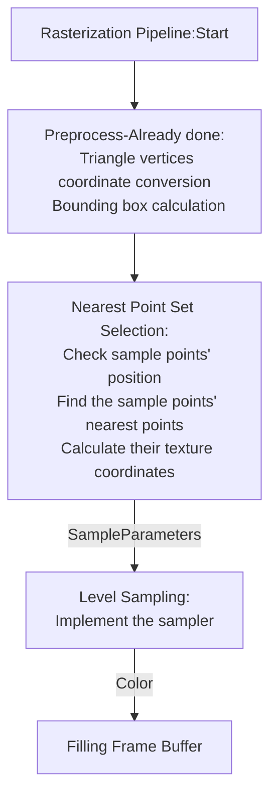
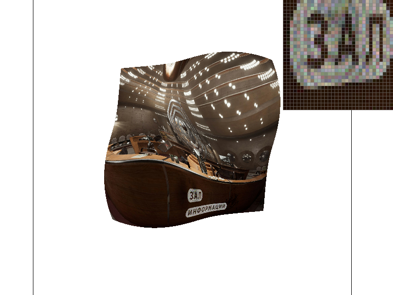
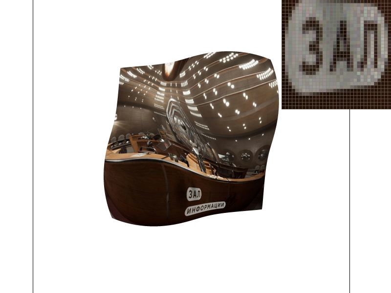
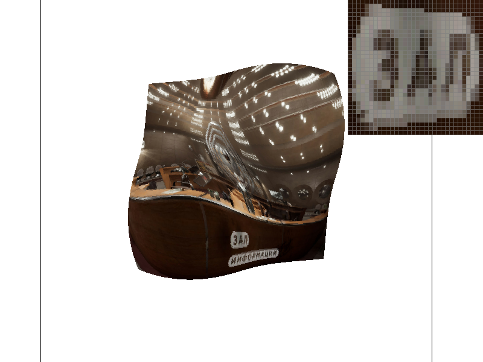
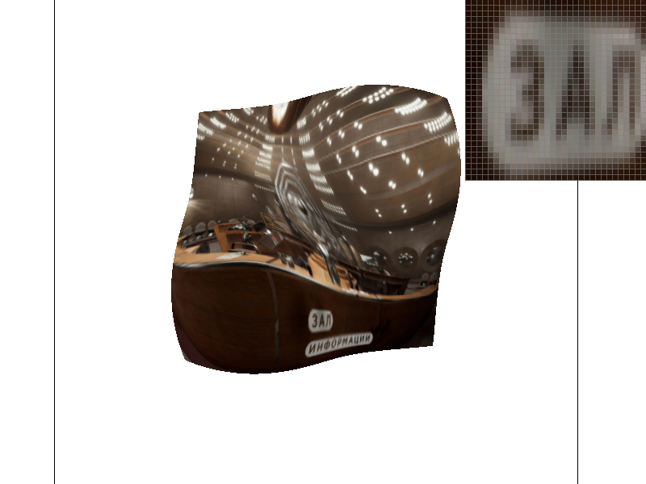

# Task 6: "Level sampling" with mipmaps for texture mapping

## Methodology

### Texture Minification

Level sampling is a technique for solving issues in texture minification. As is described in Task 5, texture minification is the process of downsampling the texture, where multiple texels correspond to one pixel. Different ways of deciding the sample pixel's color will have a significant impact on the final image quality. 

{ align=right width=30%\textwidth }

Take nearest sampling as an example, the color of the sample pixel is the color of the nearest texel, and all the rest corresponding texels are ignored. This could cause serious aliasing.

As discussed in previous tasks, bilinear sampling has been proven effective in reducing aliasing. However, averaging the color of all corresponding texels is costly, as the corresponding texel number grows exponentially with the level of minification. Such difficulties are the motivation of mipmaps.

### Mipmaps and Level Sampling

#### Overview

The idea of mipmap is to store a series of downsampled textures, the downsampling process has averaged color ahead of time. When the rasterizer is doing texture mapping, it can choose the finest mipmap level in which each texel has a similar size to the sample pixel. This way, the rasterizer can avoid the expensive averaging process and still get a smooth color transition.

The key considerations of mipmaps is how to choose the mipmap level. Once mipmap level is chosen, normal sampling process, including nearest sampling and bilinear sampling, can be applied to the chosen mipmap.

#### Mipmap Level Selection

According to the lecture, mipmap level selection can be done in several approaches:

- **Fixed mipmap level**: The mipmap level is chosen ahead of time, and the same level is used for all sample pixels. This is the simplest approach, and very similar to sampling without mipmaps.
- **Nearest level**: Based on the size of the sample pixel, the level with the closest texel size is chosen. 
- **Nearest level with interpolation**: Select two closest levels and sample them, this will result in two selected colors. Then, the final color is interpolated between the two colors based on the size of the sample pixel.

#### Calculation of Closest Mipmap Level

Assuming all mipmaps have the same aspect ratio as the original texture and the sample space, mipmap level could be calculated by inspecting the distance zoom ratio between two sample pixels and their corresponding texels. Let $L$ be the zoom level of distance, then the mipmap level $D$ can be calculated as:

$$
D = \log_{2}L
$$

As each mipmap level is downsampled by a factor of 2.

However, mipmaps do not always have the same aspect ratio as the original texture and the sample space. In this case, the three nearest pixels of the sample pixel is selected, distance zoom ratio is calculated based on the sample pixel and the x-direction nearest, and y-direction nearest respectively. The mipmap level is then calculated based on the largest distance zoom ratio, as shown in the course slides.

<figure markdown="span">
  { width=70%\textwidth }
</figure>

### Sample Combinations

The final color of the sample pixel is the color of the chosen mipmap level's texel. The color of the texel is calculated by normal sampling process, including nearest sampling and bilinear sampling. The mipmap level is chosen via the method discussed above. Together, there are six combinations of sample processes.

When mipmap is sampled by bilinear sampling and the mipmap level is chosen via nearest level interpolation, the combination is called **trilinear sampling**.

## Implementation

### The rasterization pipeline

The rasterization pipeline is modified to include the level sampling process. The following flowchart shows the rasterization pipeline with level sampling:



As the most part has been implemented in previous tasks, the focus of this task is the implementation of the Nearest point set selection and level sampling.

### Nearest Point Set Selection

Given the sample pixel, typically its right next pixel and upper next pixel are included in the nearest point set. However, to avoid the potential risk of selecting pixels outside the sample space, when the sample pixel is on the right edge of the bounding box, the left next pixel is included instead of the right one:

```cpp
        // find the nearest sample points
        // the x and y coordinates of the nearest sample points
        // in the order of current sample point, x nearest sample point, y nearest sample point
        // consider the edge case
        if (current_x_position == bounding_box_x_max)
        {
          current_nearest_x = Vector3D(current_x_position + 0.5, current_x_position - 0.5, current_x_position + 0.5);
        }
        else
        {
          current_nearest_x = Vector3D(current_x_position + 0.5, current_x_position + 1.5, current_x_position + 0.5);
        }
```

The same applies to the y direction.

```cpp
        if (current_y_position == bounding_box_y_max)
        {
          current_nearest_y = Vector3D(current_y_position + 0.5, current_y_position + 0.5, current_y_position - 0.5);
        }
        else
        {
          current_nearest_y = Vector3D(current_y_position + 0.5, current_y_position + 0.5, current_y_position + 1.5);
        }
```

Then, the Barycentric coordinates of the three points are calculated. The first, second and third weights of the Barycentric coordinates are stored in three 3D vectors, `weight_0`, `weight_1`, `weight_2` respectively.

```cpp
        // calcuate the weights of the barycentric coordinates
        weight_0 = (-(current_nearest_x - Vector3D(x1_ss)) * line12_delta_y + (current_nearest_y - Vector3D(y1_ss)) * line12_delta_x)/(-(x0_ss - x1_ss) * line12_delta_y + (y0_ss - y1_ss) * line12_delta_x);
        weight_1 = (-(current_nearest_x - Vector3D(x2_ss)) * line20_delta_y + (current_nearest_y - Vector3D(y2_ss)) * line20_delta_x)/(-(x1_ss - x2_ss) * line20_delta_y + (y1_ss - y2_ss) * line20_delta_x);
        weight_2 = (-(current_nearest_x - Vector3D(x0_ss)) * line01_delta_y + (current_nearest_y - Vector3D(y0_ss)) * line01_delta_x)/(-(x2_ss - x0_ss) * line01_delta_y + (y2_ss - y0_ss) * line01_delta_x);
```

Next, the weight of the sample point is examined to check if the sample point is inside the triangle. If so, the texture coordinates of the nearest point set are calculated, and a new `SampleParams` object is created.

```cpp
        // check if the pixel is inside the triangle
        if (weight_0[0] >= 0. && weight_1[0] >= 0. && weight_2[0] >= 0.)
        {
          // if so, calculate the the uv coordinates of the corresponding texel
          current_uv = Vector2D(u0, v0) * weight_0[0] + Vector2D(u1, v1) * weight_1[0] + Vector2D(u2, v2) * weight_2[0];
          // doesn't matter if dx or dy is negative, as we only need the magnitude
          current_dx_uv = Vector2D(u0, v0) * weight_0[1] + Vector2D(u1, v1) * weight_1[1] + Vector2D(u2, v2) * weight_2[1];
          current_dy_uv = Vector2D(u0, v0) * weight_0[2] + Vector2D(u1, v1) * weight_1[2] + Vector2D(u2, v2) * weight_2[2];

          // create a SampleParams struct
          sp.p_uv = current_uv;
          sp.p_dx_uv = current_dx_uv;
          sp.p_dy_uv = current_dy_uv;
          sp.lsm = lsm;
          sp.psm = psm;

          // call the tex.sample function
          current_color = tex.sample(sp);

          // fill the corresponding buffer
          sample_buffer[current_y_position * width * zoom_coefficient + current_x_position] = current_color;

        }
```

The `SampleParams` object is then passed to the level sampling process, which will finish the sample process and return the color of the sample pixel. The final step is to fill the corresponding buffer with the returned color.

### Sampler

The sampler requires a continuous mipmap level value to implement nearest level and interpolation sampling. This is done by `get_level` function.

The calculation process follows the method discussed in the methodology section. Noting that the texture coordinates should be scaled to the texture size.

The calculated level is only valid in the range of the mipmap levels. In the case of texture minification, the calculated level could be negative and need to be clamped to 0. In extreme cases, the calculated level could be larger than the number of mipmap levels and need to be clamped to the largest level.

To avoid calculating the largest level every time, the largest level is stored in the `Texture` class as a member variable.

```cpp hl_lines="5 16"
struct Texture {
  size_t width;
  size_t height;
  std::vector<MipLevel> mipmap;
  int numSubLevels;

  void init(const vector<unsigned char>& pixels, const size_t& w, const size_t& h) {
    width = w; height = h;

    // A fancy C++11 feature. emplace_back constructs the element in place,
    // and in this case it uses the new {} list constructor syntax.
    mipmap.emplace_back(MipLevel{width, height, pixels});

    generate_mips();

    numSubLevels = (int)(log2f((float)max(width, height)));
  }
}
```

Combining all these considerations, the `get_level` function is implemented as follows:

```cpp
  float Texture::get_level(const SampleParams& sp) {
    // TODO: Task 6: Fill this in.
    // calculate the level of the mipmap to sample from
    float Lx, Ly, L, D;
    Lx = sqrt(pow((sp.p_dx_uv.x - sp.p_uv.x) * width, 2) + pow((sp.p_dx_uv.y - sp.p_uv.y) * height, 2));
    Ly = sqrt(pow((sp.p_dy_uv.x - sp.p_uv.x) * width, 2) + pow((sp.p_dy_uv.y - sp.p_uv.y) * height, 2));
    L = max(Lx, Ly);

    D = log2(L);

    // in texture magnification, many pixels are mapped to one texel, so the level should be 0
    if (D < 0)
    {
      D = 0;
    }

    // in extreme texture minification, one texel is mapped to many pixels, so the level should be the maximum level

    if (D > numSubLevels - 1)
    {
      D = numSubLevels - 1;
    }
    return D;
  }
```


The rest part of the sampler is straightforward, which uses several `if` statements to cover all sample combinations.

Always sample at 0 level:
```cpp
    if (sp.lsm == L_ZERO)
    {
      // sample from mipmap level 0
      if (sp.psm == P_NEAREST)
      {
        return sample_nearest(sp.p_uv, 0);
      }
      else if (sp.psm == P_LINEAR)
      {
        return sample_bilinear(sp.p_uv, 0);
      }
      else
      {
        return Color(1, 0, 1);
      }
    }
```

Nearest level sampling:
```cpp
    else if (sp.lsm == L_NEAREST)
    {
      // sample from the nearest mipmap level
      int level = (int)round(get_level(sp));

      if (sp.psm == P_NEAREST)
      {
        return sample_nearest(sp.p_uv, level);
      }
      else if (sp.psm == P_LINEAR)
      {
        return sample_bilinear(sp.p_uv, level);
      }
      else
      {
        return Color(1, 0, 1);
      }
    }
```

Nearest level with interpolation sampling:
```cpp
    else if (sp.lsm == L_LINEAR)
    {
      // sample from the two nearest mipmap levels and linearly interpolate
      Color c0, c1, result;
      if (sp.psm == P_NEAREST)
      {
        c0 = sample_nearest(sp.p_uv, floor(get_level(sp)));
        c1 = sample_nearest(sp.p_uv, ceil(get_level(sp)));
      }
      else if (sp.psm == P_LINEAR)
      {
        c0 = sample_bilinear(sp.p_uv, floor(get_level(sp)));
        c1 = sample_bilinear(sp.p_uv, ceil(get_level(sp)));
      }
      else
      {
        result = Color(1, 0, 1);
      }
      result = c0 * (1 - get_level(sp) + floor(get_level(sp))) + c1 * (get_level(sp) - floor(get_level(sp)));
      return result;
    }
```
Where `c0` and `c1` are the colors of the two nearest mipmap levels, and `result` is the final color of the sample pixel. Two nearest levels are determined by the `floor` and `ceil` function.

## Results
A carefully selected example is used to demonstrate the effect of level sampling. The original texture is a 3840 * 2160 resolution screenshot of the computer game *Atomic Heart*.

<figure markdown="span">
  { width=90%\textwidth }
</figure>

SVG `svg/texmap/test6.svg `is modified and stored as `docs/test6.svg` to apply the texture.

To recode the rasterizing time of SVG, `clock` function is applied to the draw end. The rasterization time of each sampling combination is recorded.

The following figures show the rasterization option of *(level 0 sampling, nearest sampling, sample rate 1)* and *(level 0 sampling, nearest sampling, sample rate 16)*. The left figure is the simplest case without any particular sampling technique, and the other one is used as an example of no aliasing.

{ width=48%\textwidth }
{ width=48%\textwidth }

While the left one is aliased, it only takes `0.013008` seconds to rasterize. The right one is much smoother, but it takes `0.07369` seconds to rasterize. The rasterization time is increased by 5.66 times.

The following figures shows the effect of level sampling. The left figure has option *(nearest level sampling, nearest sampling, sample rate 1)* and the right one has option *(nearest level with interpolation sampling, nearest sampling, sample rate 1)*. The rasterization time of the two is `0.007655` and `0.017561` seconds respectively.

{ width=48%\textwidth }
{ width=48%\textwidth }

With nearest-level sampling, as the mipmap texture size is reduced, the rasterization time is even less than the original texture. While nearest-level sampling removed aliasing, because the texture level does not match precisely with the sample pixel's level, the text is blurred. By contrast, nearest level with interpolation sampling has a smoother result, but the rasterization time is increased by 2.3 times, which achieves a balance between the quality and the speed.

If level sampling technique is combined with bilinear sampling, the result is even better. The following figures show the comparison of trilinear sampling(left) and supersampling with sample rate 16(right).

{ width=48%\textwidth }
{ width=48%\textwidth }

The rasterization time of the two is `0.031648` and `0.07369` seconds respectively. The trilinear takes only half of the time of super sampling, while the result is similar.

## Conclusion
Level sampling is introduced to solve the aliasing problem in texture magnification and minification without the need for expensive supersampling. 

Nearest-level sampling is one simple approach, because of the minification of the texture, the rasterization time is even less than the original texture, as well as the memory consumption. It can remove aliasing, but result might be blurred as the texture level does not match precisely with the sample pixel's level.

Nearest level with interpolation sampling has a smoother result, but loading two nearest levels and linearly interpolating color requires more time and memory. Based on the test, it achieves a balance between the quality and the speed.

Level sampling techniques can be combined with bilinear sampling to achieve even better results. For example, in our test, trilinear sampling achieves the best result along all sample combinations except for supersampling. While the rasterization time is also the second longest, it is trivial when compared to the time of supersampling, and the memory consumption is close to nearest level with interpolation sampling.