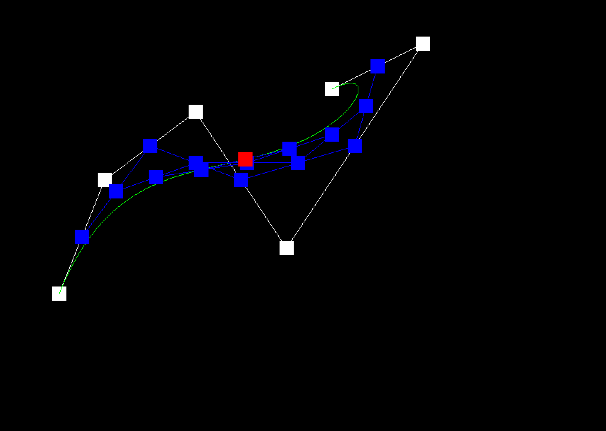
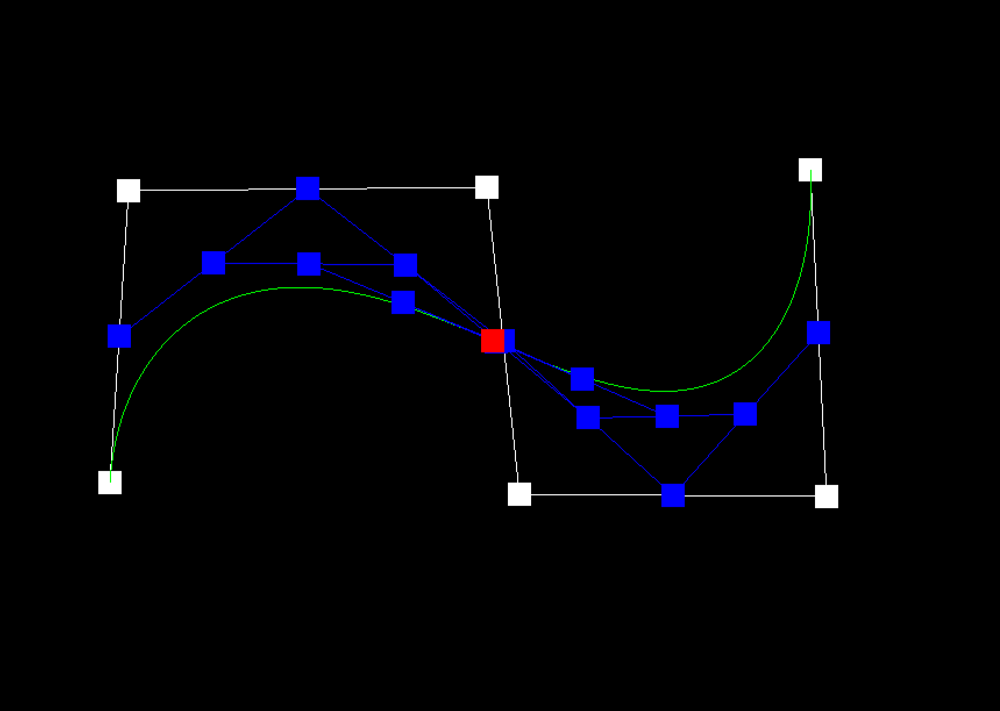

# Part 1: Bezier Curves with 1D de Casteljau Subdivision

## Methodology

de Casteljau's algorithm is a recursive algorithm that can be used to evaluate a Bezier curve. A Bezier curve is defined by a set of control points, and the curve itself is a linear combination of these control points. Assuming $t$ to be the proportion of the curve that has been traversed, this algorithm can find the corresponding point's position $B(t)$ from the curve.

The de Casteljau's algorithm can be described as follows:

1. Given a set of control points $P_0, P_1, \dots, P_n$, an empty intermediate point set $Q$ and a parameter $t$. Set $Q = P$.

2. Check if the length of $Q$ is 1. If so, return the only point in $Q$.

3. Otherwise, for each pair of points $Q_i, Q_{i+1}$ in $Q$, calculate the point by linear interpolating:

$$
Q'_i = (1-t)Q_i + tQ_{i+1}.
$$

4. Set $Q = Q'$ and repeat from step 2.

Among each loop, the number of points in $Q$ will decrease by 1, and the last point in $Q$ will be the point on the Bezier curve. To draw a Bezier curve, we can progressively evaluate the curve at different $t$ values and connect the points together.

<figure markdown="span">
  {width=90%\textwidth}
</figure>

## Implementation

In this task, we are required to implement the interpolate function of de Casteljau's algorithm. The function takes a list of intermediate points and a parameter `t`, and returns the new intermediate points after interpolation.

The implementation idea is simple: for each pair of points in the input `points` vector, calculate the intermediate point and store it in the `result` vector:
```cpp
  std::vector<Vector3D> BezierPatch::evaluateStep(std::vector<Vector3D> const &points, double t) const
  {
    // TODO Part 2.
    // Implement by Ruhao Tian starts here

    // Create a vector iterator
    std::vector<Vector3D>::const_iterator it = points.begin();

    // Create a empty vector to store the result
    std::vector<Vector3D> result;

    // Loop through the points and calculate the intermediate points
    // iterater should stop at the second last point
    while (it != points.end() - 1) {
      // Calculate the intermediate point
      Vector3D intermediate = (1 - t) * (*it) + t * (*(it + 1));
      // Add the intermediate point to the result vector
      result.push_back(intermediate);
      // Move the iterator to the next point
      it++;
    }
    
    return result;
  }
```

## Results
A 6-point Bezier curve is created to test the implementation:

```curve3.bzc
6
0.200 0.350   0.300 0.600   0.500 0.750   0.700 0.450  1.000 0.900   0.800 0.800
```

The figures below show the drawn curve as well as levels of evaluation. The left one is the curve without moving control points, and the right one is the curve with control points manually moved.
{ width=49%\textwidth } 
{ width=49%\textwidth }