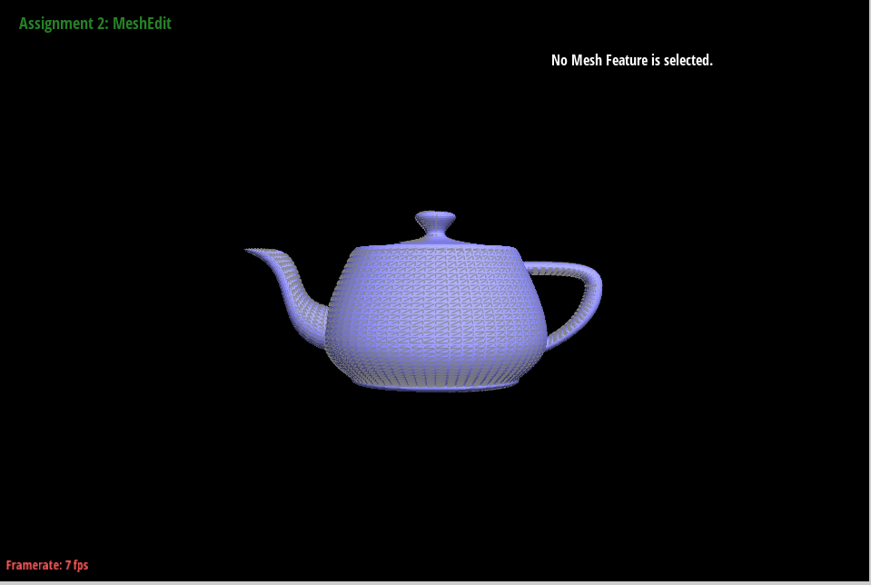

# Part2: Bezier Surfaces with Separable 1D de Casteljau

## Methodology

The main way to use de Casteljau's algorithm on the surface is: 
First, split the two-dimensional control point matrix into n one-dimensional matrices. Then, apply a method similar to Part 1 to each of these n one-dimensional matrices, obtaining coordinates for n points. Finally, use these n points coordinates for one more calculation to get the target point.

The detailed steps are listed as follows:

1. Given a two-dimensional control point matrix P (n rows and m columns). Split the two-dimensional control point matrix into n rows.

2. Apply the de Casteljau's algorithm separately to these n columns, and iterate m-1 times to obtain n final points. This operation is similar to Part 1, where n control points and parameter $t$ are used to obtain points on the Bézier curve, except here the parameter is $u$.

3. Use these n points to perform the same operation(parameter is $v$), obtaining a point that lies on the Bézier patch.

Summary: A total of $n * (m-1) + 1$ iterations are required. There are n columns in total, each column requires m-1 iterations. Finally, the n points are iterated once more.


## Implementation

The task requires returning a point that lies on the Bézier surface.

First, evaluates one step of de Casteljau's algorithm using the given points and the scalar parameter t.
```cpp
  std::vector<Vector3D> BezierPatch::evaluateStep(std::vector<Vector3D> const &points, double t) const
  {
    // TODO Part 2.
    std::vector<Vector3D>newPoints;
    
    double x,y,z;
    for(int i=0;i<points.size()-1;i++){
      x=points[i].x*t+points[i+1].x*(1-t);
      y=points[i].y*t+points[i+1].y*(1-t);
      z=points[i].z*t+points[i+1].z*(1-t);
      newPoints.emplace_back(x,y,z);
    }
    return newPoints;
  }
```

Second, fully evaluates de Casteljau's algorithm for a vector of points at scalar parameter t.
```cpp
  Vector3D BezierPatch::evaluate1D(std::vector<Vector3D> const &points, double t) const
  {
    // TODO Part 2.

    //Below is for iteration. If its size==1, it is the goal point.
    std::vector<Vector3D>operatePoints=points;
    
    double x,y,z;
    while(operatePoints.size()>1){
      operatePoints=evaluateStep(operatePoints,t);
    }
    return operatePoints.front();
  }
```

Finally, evaluate the Bezier patch at parameter (u, v)
```cpp

Vector3D BezierPatch::evaluate(double u, double v) const 
  {  
    // TODO Part 2.

    //Fully evaluate de Casteljau's algorithm for each row of the 
    //two-dimensional control. Result is rowPoints.
    std::vector<Vector3D> rowPoints;
    for(int i=0;i<controlPoints.size();i++){
      rowPoints.push_back(evaluate1D(controlPoints[i],u));
    }

    //Fully evaluate de Casteljau's algorithm for rowPoints
    //Result is patchPoint(the goal)
    Vector3D patchPoint;
    patchPoint=evaluate1D(rowPoints,v);
    return patchPoint;
  }

```

## Results

The figures below show the drawn picture of the teapot.bez


{ width=49%\textwidth } 
