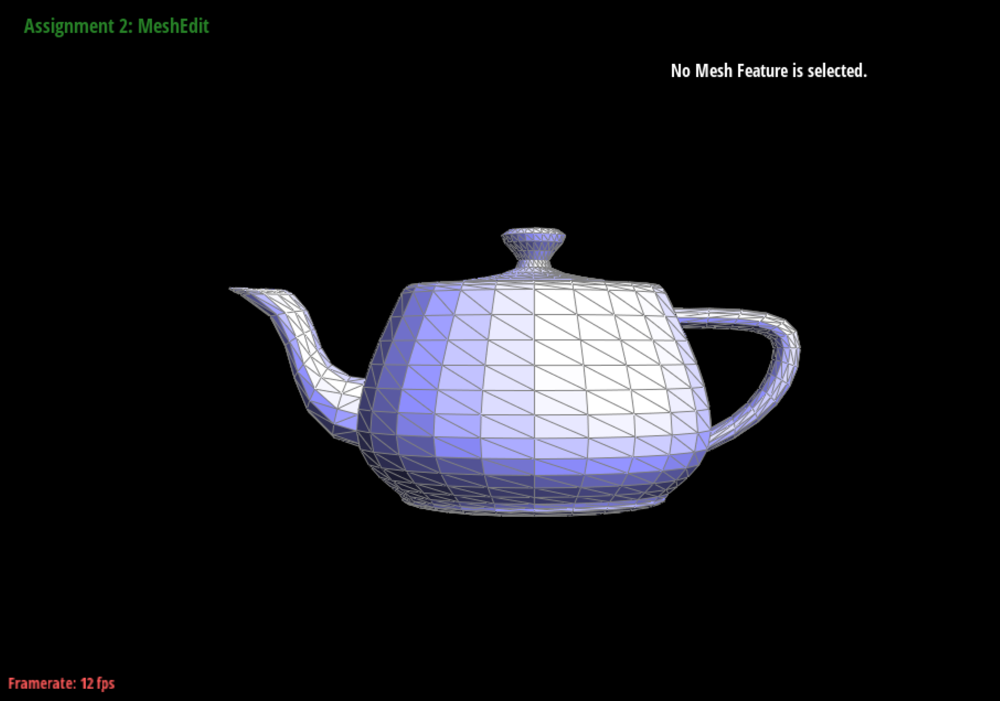
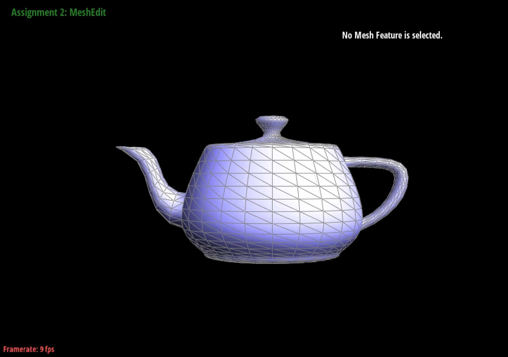

# Part 3: Area-Weighted Vertex Normals

## Methodology
Given a vertex on the mesh, the normal vector of the vertex is the average of the normal vectors of all the triangles that share the vertex. Assume $N_0, N_1, \dots, N_k$ are the normal vectors of the triangles that share the vertex, the normal vector of the vertex is calculated as follows:

$$
N = \frac{N_0 * A_0 + N_1 * A_1 + \dots + N_k * A_k}{||N_0 * A_0 + N_1 * A_1 + \dots + N_k * A_k||}
$$

where $A_0, A_1, \dots, A_k$ are the areas of the triangles that share the vertex. The normal vector is normalized to ensure it has a unit length.

## Implementation
The general idea is to iterate through all faces and calculate the normal vector and area of each face. In halfedge data structure, each face has a corresponding halfedge, and visiting the next face counter-clockwise is equal to visiting its half edge:

```cpp
next_halfedge = current_halfedge->twin()->next();
```

And when `current_halfedge == start_halfedge`, the iteration is finished.

For each face, the normal vector can be obtained by the provided `normal` function:
```cpp
current_face_normal = current_halfedge->face()->normal();
```

To calculate the area of the face, first, the three vertices of the face are obtained:
```cpp
      vertex_position[0] = current_halfedge->vertex()->position;
      vertex_position[1] = current_halfedge->next()->vertex()->position;
      vertex_position[2] = current_halfedge->next()->next()->vertex()->position;
```
    
Then the area of the face is calculated by the cross product of two edges of the face:
```cpp
    current_face_area = cross(vertex_position[1] - vertex_position[0], vertex_position[2] - vertex_position[0]).norm() / 2;
```
    
During the iteration, the normal vector and area of each face are accumulated to an intermediate normal vector, which will be normalized and returned when the iteration is finished:
```cpp
      intermediate_normal += current_face_normal * current_triangle_area;
```

Putting all the pieces together, the implementation of the `normal` function is as follows:
```cpp
  Vector3D Vertex::normal( void ) const
  {
    // TODO Part 3.
    // Returns an approximate unit normal at this vertex, computed by
    // taking the area-weighted average of the normals of neighboring
    // triangles, then normalizing.

    // Implementaion by Ruhao Tian starts here

    // Prepare intermediate variables
    HalfedgeCIter current_halfedge, start_halfedge, next_halfedge;
    Vector3D intermediate_normal,current_face_normal;
    double current_triangle_area;
    Vector3D vertex_position[3];

    // Initialize the normal vector
    intermediate_normal = Vector3D(0, 0, 0);
    current_halfedge = start_halfedge = this->halfedge();

    // Loop through the halfedges of the vertex
    do {
      // for safety, first obtain the next halfedge, although this is not mandatory
      next_halfedge = current_halfedge->twin()->next();

      // obtain the face normal
      current_face_normal = current_halfedge->face()->normal();

      // calculate the area of the triangle
      // first, obtain the three vertices position
      vertex_position[0] = current_halfedge->vertex()->position;
      vertex_position[1] = current_halfedge->next()->vertex()->position;
      vertex_position[2] = current_halfedge->next()->next()->vertex()->position;
      // use the cross product to calculate the area
      current_triangle_area = cross(vertex_position[1] - vertex_position[0], vertex_position[2] - vertex_position[0]).norm() / 2;

      // add the area-weighted normal to the intermediate normal
      intermediate_normal += current_face_normal * current_triangle_area;

      // move to the next halfedge
      current_halfedge = next_halfedge;
    } while (current_halfedge != start_halfedge);

    // normalize the intermediate normal
    intermediate_normal.normalize();
    return intermediate_normal;
  }
```

## Results
The left figure below is the screenshot of `dae/teapot.dae` without normal vector shading and the right one is the same mesh with normal vector shading enabled. Compared with the left one, figure implemented normal vector clearly has smoother shading.

!!! info "Image displayed size too small?"

    Click on the image to activate lightbox mode.
    In lightbox mode, click on the arrows on the left and right to navigate through images. This brings easy comparison.

{width=49%\textwidth}
{width=49%\textwidth}