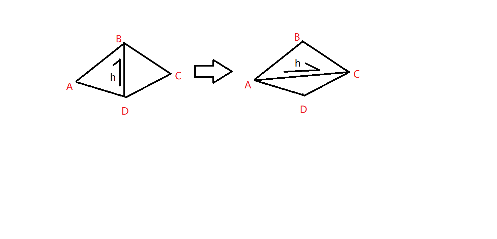
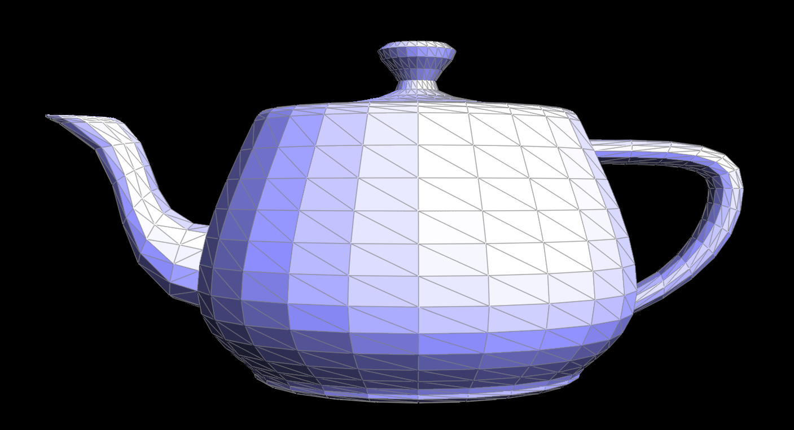

# Part4: Edge Split

## Methodology

Get the flip image by modifying the given halfedge and related parameter pointers.Below is a example of modifications made to haldedge:


As shown in the diagram, we now need to modify the pointers related to the halfedge h.

{width=49%\textwidth}
After modification:
1.The starting point of the halfedge becomes A, and it points to D.
2.The twin() of the halfedge remains unchanged, but it now points to the modified halfedge in the opposite direction.
3.The next() of the halfedge becomes CB.
4.The face that the halfedge points to becomes ABC.

Similar operations will also be performed on vertices, faces, and so on. This includes, but is not limited to, the following changes:
The half-edge pointed to by A becomes h.
The faces change from ABD, BCD to ABC, ACD.

The rest of the operations are very similar, so I won't go into further detail. However, you can find any information you are interested in within the code.

## Implementation

Before providing my code, I would like to explain the parameters:


1. h is the h shown in the diagram.
2. th=h->twin()
3. h/th_next=h/th->next()
4. h/th_pre->next()=h/th
```cpp
  HalfedgeIter h=e0->halfedge();
  HalfedgeIter th=h->twin();
  HalfedgeIter h_next=h->next();
  HalfedgeIter th_next=th->next();
  HalfedgeIter h_pre=h_next->next();
  HalfedgeIter th_pre=th_next->next();

```

v1,v2,v3,v4 is A,B,C,D
```cpp
  VertexIter v1=h_pre->vertex();
  VertexIter v2=h->vertex();
  VertexIter v4=th_pre->vertex();
  VertexIter v3=th->vertex();
```

Total solution code:
```cpp
EdgeIter HalfedgeMesh::flipEdge( EdgeIter e0 )
  {
    // TODO Part 4.
    // This method should flip the given edge and return an iterator to the flipped edge.

    //edge is not allowed
    if(e0->isBoundary()) return e0;


    HalfedgeIter h=e0->halfedge();
    HalfedgeIter th=h->twin();
    HalfedgeIter h_next=h->next();
    HalfedgeIter th_next=th->next();
    HalfedgeIter h_pre=h_next->next();
    HalfedgeIter th_pre=th_next->next();

    VertexIter v1=h_pre->vertex();
    VertexIter v2=h->vertex();
    VertexIter v4=th_pre->vertex();
    VertexIter v3=th->vertex();

    FaceIter f1=h->face();
    FaceIter f2=th->face();

    //change the halfedge pointer
    h->setNeighbors(th_pre,th,v1,h->edge(),f1);
    th_pre->setNeighbors(h_next,th_pre->twin(),v4,th_pre->edge(),f1);
    h_next->setNeighbors(h,h_next->twin(),v3,h_next->edge(),f1);
    th->setNeighbors(h_pre,h,v4,h->edge(),f2);
    h_pre->setNeighbors(th_next,h_pre->twin(),v1,h_pre->edge(),f2);
    th_next->setNeighbors(th,th_next->twin(),v2,th_next->edge(),f2);

    //change the vertex pointer
    v1->halfedge()=h;
    v2->halfedge()=th_next;
    v3->halfedge()=h_next;
    v4->halfedge()=th;


    //change the face pointer
    f1->halfedge()=h;
    f2->halfedge()=th;

    return e0;
  }
```

## Results


The figure below show the original teapot.
{ width=49%\textwidth } 

The following image shows the teapot after fliping 4 edges. I have highlighted the modifications with a yellow highlighter.
{ width=49%\textwidth } 
