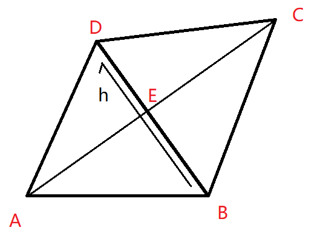
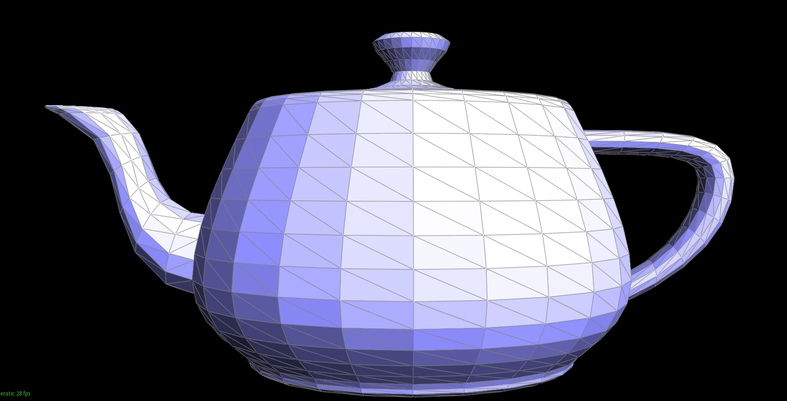
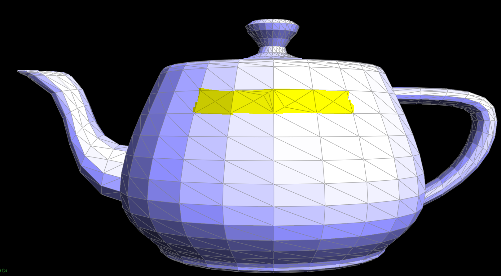
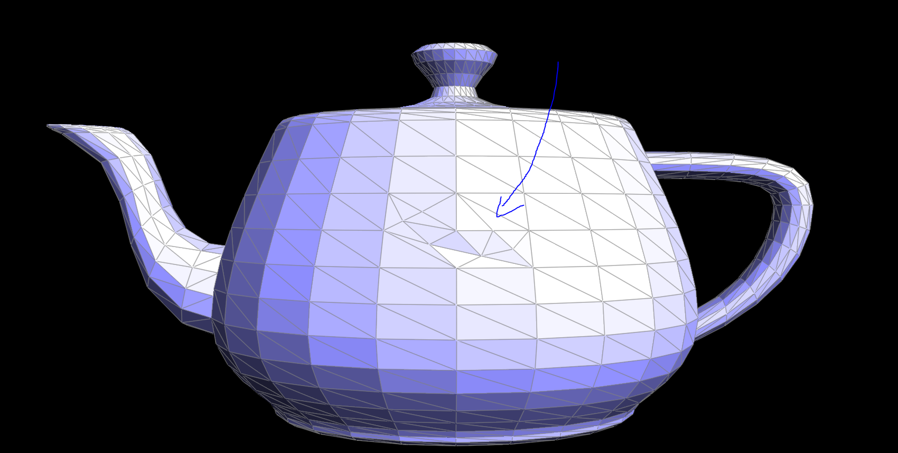

# Part2: Bezier Surfaces with Separable 1D de Casteljau

## Methodology


The method of edge splitting is similar to Part 4, but it will be a bit more complex. This requires us to consider a new vertex and the 6 new halfedges that are created. We adjust their values and pointers to accomplish the edge split. Here is a simple example explaining the adjustment of pointers for the halfedge h and the new vertex E.

{ width=49%\textwidth } 

for h after modification:
1.The starting point of the halfedge remains B, but it points to E now.
2.The twin() becomes the EB.
3.The next() of the halfedge becomes EA.
4.The face that the halfedge points to becomes ABE.

for e after modification:
1. Its position is descripted by $(E_x,E_y)=0.5*[(B_x,B_y)+(D_x,D_y)]$
2. It points to ED.

Similar operations will also be performed on vertices, faces, and so on. This includes, but is not limited to, the following changes:
The half-edge pointed to by A becomes AE
Now there are four faces(ABE,AED,DEC,BEC)

The rest of the operations are very similar, so I won't go into further detail. However, you can find any information you are interested in within the code.


## Implementation

Before providing my code, I would like to explain the parameters:
k is the h shown in the picture. p,q,r,s,x,y are the new halfedge.
```cpp
  HalfedgeIter j, k, l, m, n, o, j_new, k_new, l_new, m_new, n_new, o_new, p_new, q_new, r_new, s_new,x_new,y_new;
  k_new = k = e0->halfedge();
  l_new = l = k->next();
  j_new = j = l->next();
  o_new = o = e0->halfedge()->twin();
  m_new = m = o->next();
  n_new = n = m->next();
  p_new = newHalfedge();
  q_new = newHalfedge();
  r_new = newHalfedge();
  s_new = newHalfedge();
  x_new = newHalfedge();
  y_new = newHalfedge();
```
a,b,c,d,e are the A,B,C,D,E shown in the picture.
```cpp
  VertexIter a, b, c, d, a_new, b_new, c_new, d_new, e_new;
  a_new = a = j->vertex();
  b_new = b = k->vertex();
  c_new = c = l->vertex();
  d_new = d = n->vertex();
  e_new = newVertex();
```
Total solution code:
```cpp
VertexIter HalfedgeMesh::splitEdge( EdgeIter e0 )
  {
    // TODO Part 5.
    // This method should split the given edge and return an iterator to the newly inserted vertex.
    // The halfedge of this vertex should point along the edge that was split, rather than the new edges.
    HalfedgeIter j, k, l, m, n, o, j_new, k_new, l_new, m_new, n_new, o_new, p_new, q_new, r_new, s_new,x_new,y_new;
    k_new = k = e0->halfedge();
    l_new = l = k->next();
    j_new = j = l->next();
    o_new = o = e0->halfedge()->twin();
    m_new = m = o->next();
    n_new = n = m->next();
    p_new = newHalfedge();
    q_new = newHalfedge();
    r_new = newHalfedge();
    s_new = newHalfedge();
    x_new = newHalfedge();
    y_new = newHalfedge();

    VertexIter a, b, c, d, a_new, b_new, c_new, d_new, e_new;
    a_new = a = j->vertex();
    b_new = b = k->vertex();
    c_new = c = l->vertex();
    d_new = d = n->vertex();
    e_new = newVertex();

    EdgeIter ab, bc, ca, bd, dc, ab_new, bc_new_ec, ca_new, bd_new, dc_new, ae_new, be_new, ed_new;
    ab_new = ab = j->edge();
    bc_new_ec = bc = k->edge();
    ca_new = ca = l->edge();
    bd_new = bd = m->edge();
    dc_new = dc = n->edge();
    ae_new = newEdge();
    be_new = newEdge();
    ed_new = newEdge();

    FaceIter f1, f2, f1_new, f2_new, f3_new, f4_new;
    f1_new = f1 = k->face();
    f2_new = f2 = o->face();
    f3_new = newFace();
    f4_new = newFace();

    // Update the halfedges
    j_new->setNeighbors(x_new, j->twin(), a, ab, f3_new);
    k_new->setNeighbors(l,o,e_new,bc,f1);
    l_new->setNeighbors(p_new,l->twin(),c,ca,f1);
    m_new->setNeighbors(s_new,m->twin(),b,bd,f4_new);
    n_new->setNeighbors(o,n->twin(),d,dc,f2);
    o_new->setNeighbors(r_new,k,c,bc,f2);
    p_new->setNeighbors(k,q_new,a,ae_new,f1);
    q_new->setNeighbors(j,p_new,e_new,ae_new,f3_new);
    r_new->setNeighbors(n_new,s_new,e_new,ed_new,f2);
    s_new->setNeighbors(y_new,r_new,d,ed_new,f4_new);
    x_new->setNeighbors(q_new,y_new,b,be_new,f3_new);
    y_new->setNeighbors(m,x_new,e_new,be_new,f4_new);

    // Update the vertices
    a_new->halfedge() = j;
    b_new->halfedge() = m;
    c_new->halfedge() = l;
    d_new->halfedge() = n;
    e_new->halfedge() = k;

    // Update the edges
    ab_new->halfedge() = j;
    be_new->halfedge() = y_new;
    ae_new->halfedge() = q_new;
    bc_new_ec->halfedge() = k;
    ca_new->halfedge() = l;
    bd_new->halfedge() = m;
    dc_new->halfedge() = n;
    ed_new->halfedge() = s_new;

    // Update the faces
    f1_new->halfedge() = k;
    f2_new->halfedge() = o;
    f3_new->halfedge() = j;
    f4_new->halfedge() = m;

    // Update the position of the new vertex
    // The new vertex should be the average of the two original vertices, b and c
    e_new->position = (b->position + c->position) / 2;
    return e_new;
  }
```

## Results


The figures below is the original teapot.
{ width=49%\textwidth } 

After some edge splits:
{ width=49%\textwidth } 

After a combination of both edge splits and edge flips:
{ width=49%\textwidth } 
