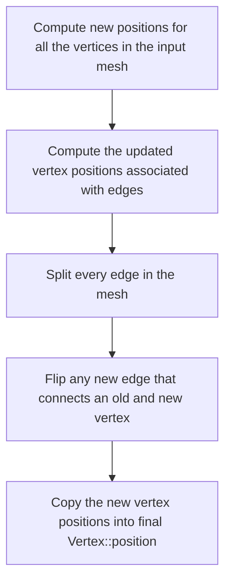
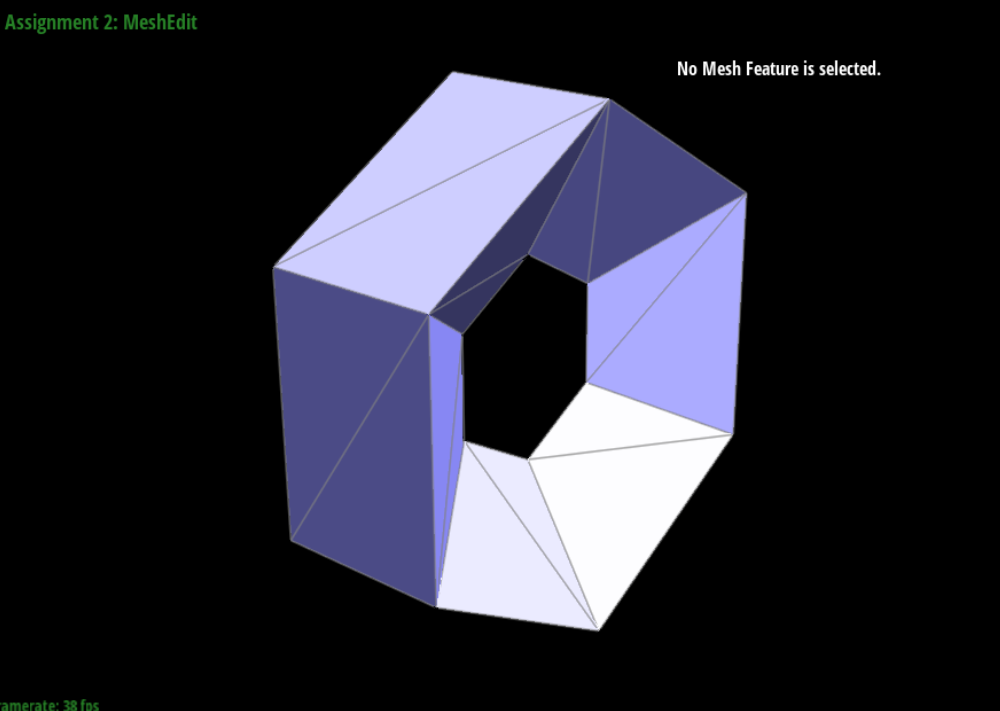
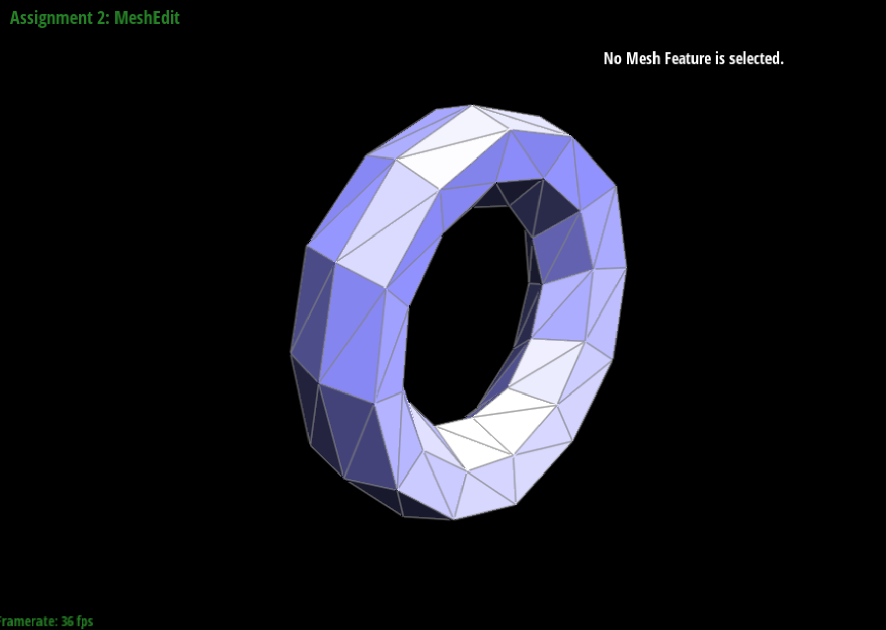
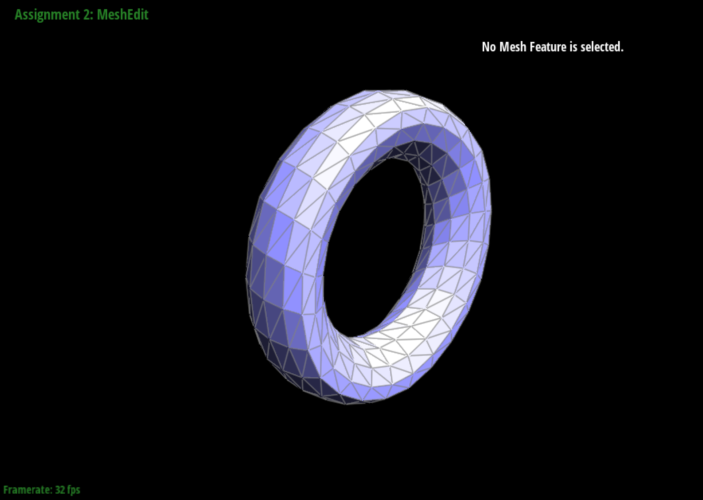
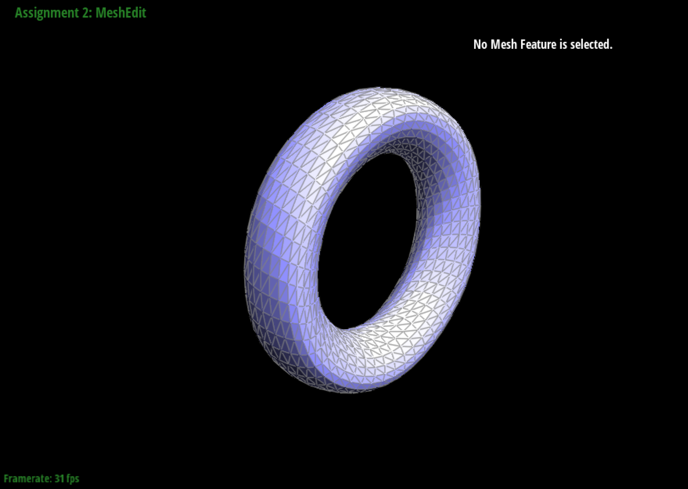
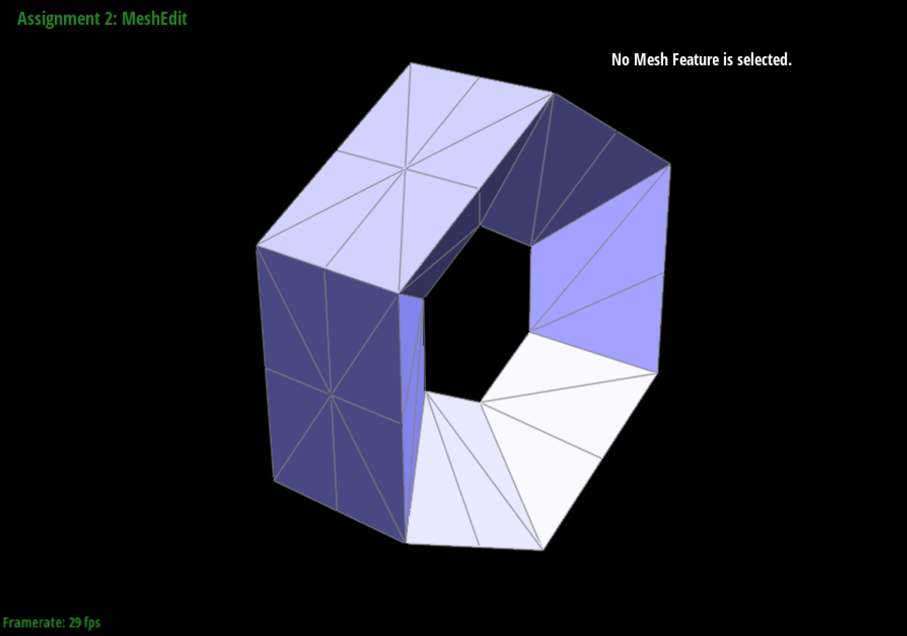
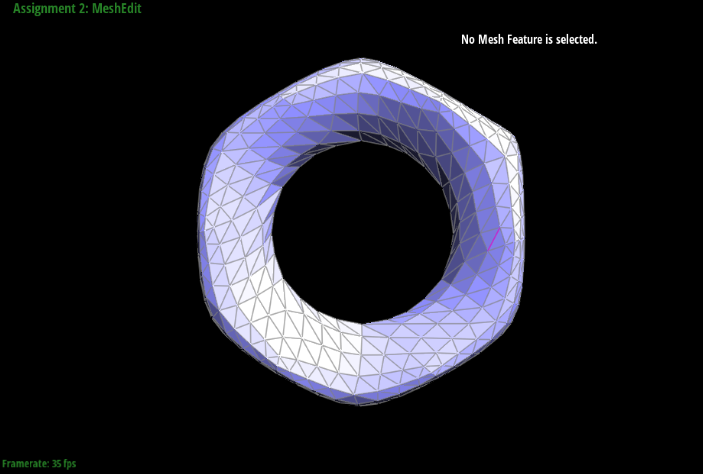
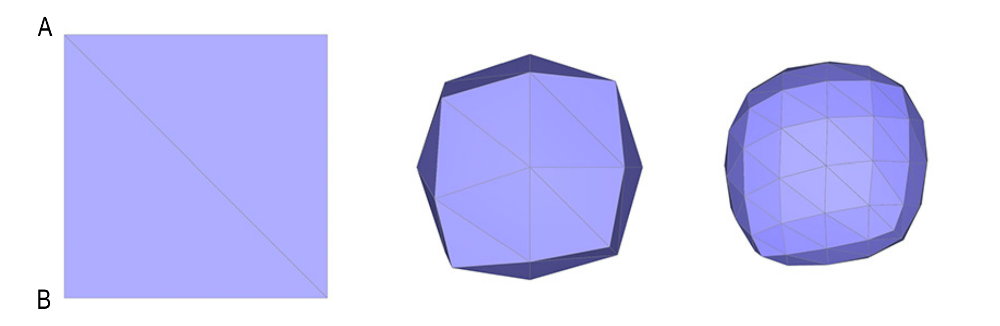
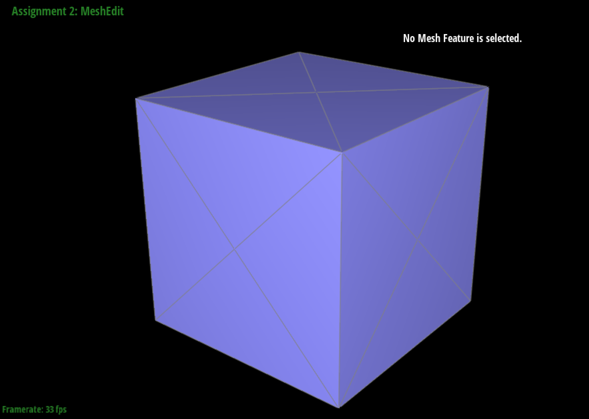
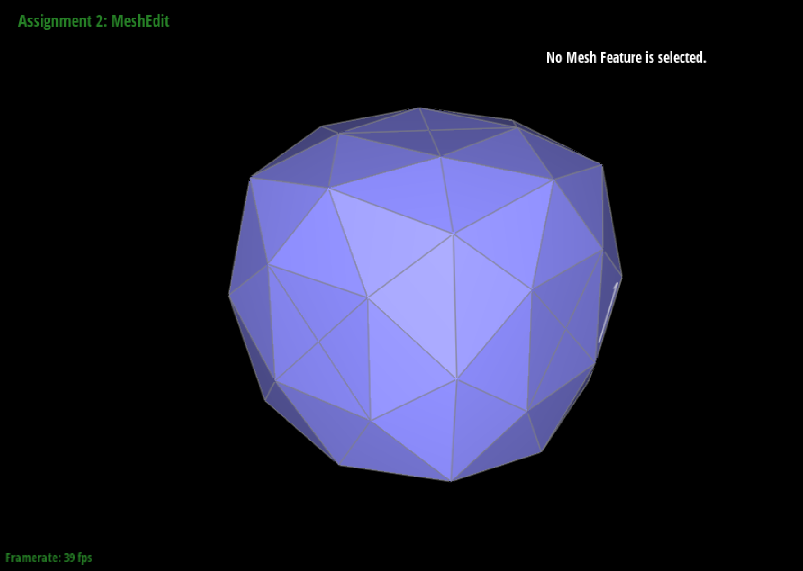

# Part 6: Loop Subdivision for Mesh Upsampling

## Methodology
Loop subdivision is a mesh upsampling technique for triangle meshes. It is a simple and efficient way to increase the number of triangles in a mesh. The algorithm involves two main steps: triangle subdivision and vertex position update.

### Triangle Subdivision
The subdivision of a triangle is done by adding a new vertex at the center of each edge and connecting the new vertices to form 4 new triangles. 


Triangle subdivision can be decomposed into two steps:

1. Split all edges of the mesh
2. For the new edges, flip the one that connects both new and old vertices

### Vertex Position Update
The position of vertices is determined by the surrounding vertices.


For a new vertex splitting edge $AB$, the new position is calculated as:

$$
\frac{3}{8}(A + B) + \frac{1}{8}(C + D)
$$

where $C$ and $D$ are the vertices of the adjacent triangles to the edge $AB$.

For an existing vertex, the new position is updated as:

$$
(1-n*u)*P + {u} * \sum_{i=1}^{n}P_i
$$

where $P$ is the original position of the vertex, $P_i$ is the position of the $i^{th}$ vertex connected to $P$, and $n$ is degree of $P$. $u$ is a constant that depends on $n$, as described in the figure.

## Implementation

### Subdivision Overview
The recommended steps provided by the course website are followed to implement the Loop subdivision algorithm, as illustrated below:



Each step is explained in detail in the following sections.

### Compute Existing Vertex Positions
Given a vertex in the mesh, the calculation of its updated position involves obtaining all the surrounding vertices and computing the new position based on the degree of the vertex. 

To iterate over all connected vertices, halfedge iterator `current_halfedge` and `start_halfedge` are used to control the traversal. The degree `n` is incremented for each visited vertex, and the position of the vertex is added to the sum `new_position`.

```cpp
      // initialize the new position
      new_position = Vector3D(0, 0, 0);
      current_halfedge = start_halfedge = v->halfedge();
      n = 0;

      // loop through the halfedges of the vertex
      do
      {
        // add the position of the nearby vertex to the new position
        new_position += current_halfedge->next()->vertex()->position;
        n++;
        // move to the next halfedge
        current_halfedge = current_halfedge->twin()->next();

      } while (current_halfedge != start_halfedge);
```

When all the surrounding vertices are visited, the new position is updated using the formula provided in the methodology section.

```cpp
      if (n == 3)
      {
        u = 3.0 / 16.0;
      }
      else
      {
        u = 3.0 / (8.0 * n);
      }
      // calculate the new position
      new_position = (1 - n * u) * v->position + u * new_position;
```

The above process is repeated for all vertices in the mesh to obtain the updated positions.

### Compute New Vertex Positions
A new vertex is added at the midpoint of each edge in the mesh. The new position is calculated using the positions of the two vertices connected by the edge and the positions of the vertices of the adjacent triangles.

First, the four vertices are obtained by halfedge traversal.
```cpp
      // locate the four surrounding vertices
      VertexIter a = e->halfedge()->vertex();
      VertexIter b = e->halfedge()->twin()->vertex();
      VertexIter c = e->halfedge()->twin()->next()->next()->vertex();
      VertexIter d = e->halfedge()->next()->next()->vertex();
```

Then, the new position is calculated using the formula provided in the methodology section.
```cpp
      // calculate the new position for the new vertices
      e->newPosition = 3.0 / 8.0 * (a->position + b->position) + 1.0 / 8.0 * (c->position + d->position);
```

This step is repeated for all edges in the mesh to obtain the new vertex positions.

### Split Edges
In loop subdivision, every edge in the mesh is split once and only once. To prevent repeated splitting, status of each edge need to be tracked. The starter code provides an `Edge::isNew`` flag to indicate whether the edge is new or not. 

However, there are multiple definitions of new and old edges in this problem. 

- **Logical New Edge**: An edge that is created during the subdivision process. It is not present in the original mesh. **When an old edge is split into two parts, these parts are treated as old edges.**
- **Chronological New Edge**: The edges formed after splitting an old edge are treated as new edges.

For this subsection, both definitions are feasible. However, for the whole problem, only the logical new edge is practical. This will be discussed in the next section.

As logical new edge definition cannot decide whether an edge has been split or not, alternative method is used to track the status of each edge. For a newly split edge, it must connect one new vertex and one old vertex. This way, the edge split can be completed within a single iteration of the mesh edges.

First, all the current edges and vertices are marked as old ones:
```cpp
    // now every edge in the mesh is old edge
    // set the isNew flag to false for every edge
    for (EdgeIter e = mesh.edgesBegin(); e != mesh.edgesEnd(); e++)
    {
      e->isNew = false;
    }

    // now every vertex in the mesh is old vertex
    // set the isNew flag to false for every vertex
    for (VertexIter v = mesh.verticesBegin(); v != mesh.verticesEnd(); v++)
    {
      v->isNew = false;
    }
```

Then the iteration begins. For specific edges, check if it is a chronological new edge:
```cpp
      if (e->halfedge()->vertex()->isNew || e->halfedge()->twin()->vertex()->isNew)
      {
        continue;
      }
```

After the edge is split, the chronologically new edges are marked as logically new and old edges:
```cpp
      // split the edge
      Vector3D new_position = e->newPosition;
      VertexIter new_vertex = mesh.splitEdge(e);
      // set the isNew flag to true for the new edges
      // the original edge, which is now split into two edges, is regarded as a old edge
      HalfedgeIter current_halfedge = new_vertex->halfedge();
      current_halfedge->edge()->isNew = false; // one of the original edges
      current_halfedge = current_halfedge->twin()->next();
      current_halfedge->edge()->isNew = true; // one new edge
      current_halfedge = current_halfedge->twin()->next();
      current_halfedge->edge()->isNew = false; // one of the original edges
      current_halfedge = current_halfedge->twin()->next();
      current_halfedge->edge()->isNew = true; // one new edge
```

The last step is to process the new vertex. Besides setting it as a new vertex, we immediately assign its `newPosition`. This is because the edge containing its new position might be flipped in the next section and the pointer to it could be lost.
```cpp
      // set the isNew flag to true for the new vertex
      new_vertex->isNew = true;
      // set the new position for the new vertex immediately
      // because the edge containing the new vertex might be flipped, and the new position will be lost
      new_vertex->newPosition = new_position;
```

### Flip New Edges
The edges that required flipping are the ones that:

- **Is logically new**: This is why the logical new edge definition is used. Chronologically new edges are not necessarily flipped, like the ones that are two parts of a split edge.
- **Connects an old vertex and a new vertex**: As mentioned in the methodology section.

The corresponding code is:
```cpp
      // check if the edge is a new edge
      if (!e->isNew)
      {
        continue;
      }

      // check if the edge connects an old and new vertex
      if (e->halfedge()->vertex()->isNew==e->halfedge()->next()->vertex()->isNew)
      {
        continue;
      }
      else
      {
        // flip the edge
        mesh.flipEdge(e);
      }
```

### Copy New Vertex Positions
Because both the mesh's original vertices and the ones created by splitting edges have their 'newPosition' set, the final step is to copy the new positions to the original positions.
```cpp
    // 5. Copy the new vertex positions into final Vertex::position.
    // iterate through all vertices
    for (VertexIter v = mesh.verticesBegin(); v != mesh.verticesEnd(); v++)
    {
      // update the position of the old vertex
      v->position = v->newPosition;
    }
```

## Results
The following images are the upsampling result of `dae/torus/input.dae` with level 0,1,2, and 3 loop subdivision. The mesh is clearly smoother as the level increases.

{width=49%}
{width=49%}
{width=49%}
{width=49%}

One problem is that the sharp edges are smoothed out. Inspecting loop subdivision from a qualitative perspective, the new position of a vertex is determined by its surrounding vertices. This means if a vertex is distant from its neighbors, its distinct position will be averaged out. So to preserve sharp edges, we need to add more vertex around them to strengthen their influence. The following images are the same mesh but with pre-processed outer faces at upsample level 0 and 2. The outer sharp edges are much better preserved.

{width=49%}
{width=49%}

The same applies to `dae/cube.dae`. Considering only the face towards us, corner $A$ is averaged by its three neighbors during upsampling, while corner $B$ is averaged by two. If we apply this idea recursively to the triangles created by subdivision, we can see that the influence of corner $A$ is much stronger than corner $B$. This is why corner $A$ is much smoother than corner $B$ in the upsampled mesh.

{width=100%}

This provides a hint to solve the asymmetric problem. We need to ensure the structure of neighboring vertices of the corners is symmetric. A simple pre-processing is used in the following figures. The asymmetry is removed after loop subdivision.

{width=49%}
{width=49%}