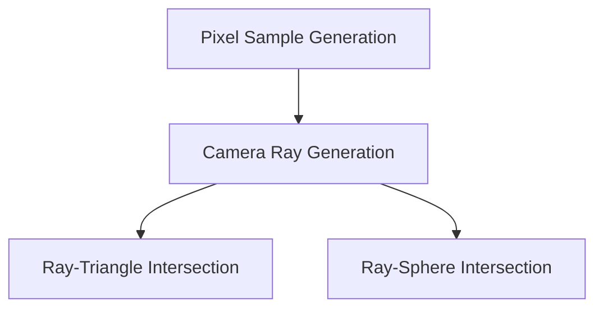
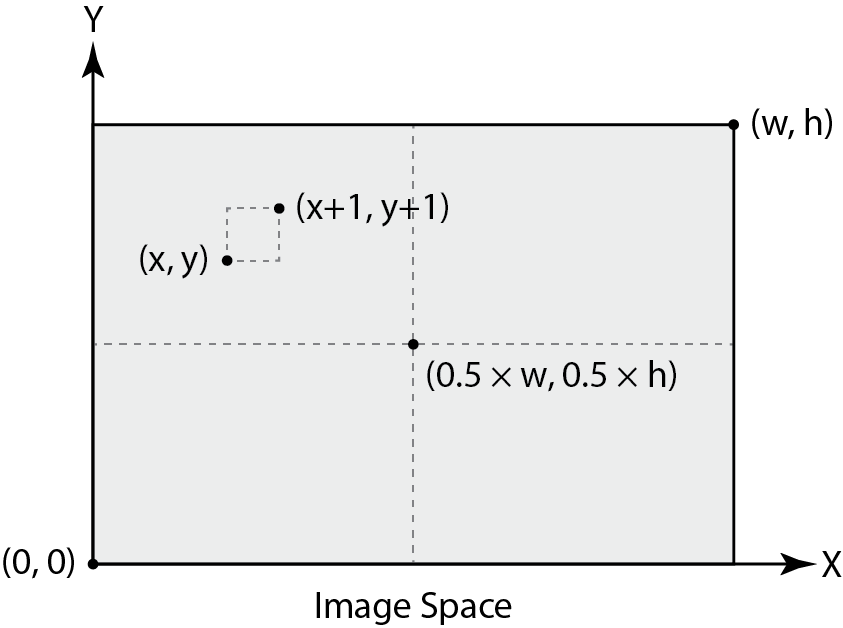
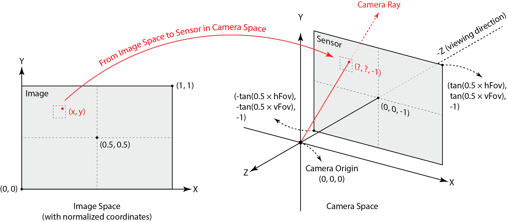

# Part1: Ray Generation and Scene Intersection

## Overview: The ray generation and intersection pipeline

In this part, we implemented the ray generation and intersection pipeline for the Pathtracer. The pipeline consists of the following steps:



The above sections will be explained in detail in the following sections.

## Pixel Sample Generation

### Methodology

In the Pathtracer, each pixel of the image is sampled `ns_aa` times. The input pixel coordinates lie in the unnormalized image space, i.e., the range of the coordinates is from 0 to `width` and 0 to `height`. 



Each sample process consists of the following steps:

1. Generate a random sample point in the pixel space.
2. Normalize the sample point to the camera space.
3. Generate a ray from the camera origin to the sample point.
4. Obtain the returned color and add it to the pixel color.

### Implementation

The grid sampler provided in the starter code is used to generate the sample points:
    
```cpp
      // generate a random sample
      sample = gridSampler->get_sample();
```

As the width and height of the camera space are 1, the sample point is normalized by dividing the sample point by the width and height of the sample buffer:

```cpp
      xsample_normalized = ((double)x + sample.x) / sampleBuffer.w;
      ysample_normalized = ((double)y + sample.y) / sampleBuffer.h;
```

Finally, the ray is generated from the camera origin to the sample point, and the returned color is added to the pixel color:

```cpp
      // generate a random ray
      r = camera->generate_ray(xsample_normalized, ysample_normalized);
      // trace the ray
      L_out += est_radiance_global_illumination(r);
```

This process is repeated for `ns_aa` times to obtain the final pixel color. The result is averaged and assigned to the pixel buffer.

## Camera Ray Generation

### Methodology

The given pixel position is in the normalized image space. After obtaining its position in the camera space, the ray direction in the camera space is determined. To generate the ray, this direction is transformed to the world space.



Transforming pixel position from the normalized image space to the camera space involves translating the pixel position to the camera space and scaling it by the camera width and height. The translation matrix is given by:

$$
\begin{bmatrix}
1 & 0 & -0.5 \\
0 & 1 & -0.5 \\
0 & 0 & 1
\end{bmatrix}
$$

The scaling matrix is given by:

$$
\begin{bmatrix}
2 \times \tan(\frac{hFov}{2}) & 0 & 0 \\
0 & 2 \times \tan(\frac{vFov}{2}) & 0 \\
0 & 0 & 1
\end{bmatrix}
$$

The ray direction in the camera space is the vector from the camera position to the sensor position. The sensor position is obtained by changing the third component of the pixel position to -1. 

The camera-to-world matrix the given and does not need to be computed. 

### Implementation

First, the translation matrix `move_to_center` and scaling matrix `scale_to_sensor` are defined:

```cpp
  // step 1: transform the input image coordinate to the virtual sensor plane coordinate
  // move the input image coordinate to the center of the image plane
  Matrix3x3 move_to_center = Matrix3x3(1, 0, -0.5, 0, 1, -0.5, 0, 0, 1);
  // scale the input image coordinate to the sensor plane coordinate
  // the virtual sensor plane is 1 unit away from the camera
  Matrix3x3 scale_to_sensor = Matrix3x3(2 * tan(radians(hFov / 2)), 0, 0, 0, 2 * tan(radians(vFov / 2)), 0, 0, 0, 1);
```

The pixel position is transformed to the sensor position by multiplying the translation and scaling matrices:

```cpp
  // apply the transformation
  Vector3D input_image_position = Vector3D(x, y, 1);
  Vector3D sensor_position = scale_to_sensor * move_to_center * input_image_position;
```

The ray direction in the camera space is the vector from the camera position to the sensor position:

```cpp
  // step 2: compute the ray direction in camera space
  // the ray direction is the vector from the camera position to the sensor position
  // in camera space, camera is at the origin
  // simply change the third component of the sensor position to -1
  Vector3D ray_direction_in_camera = {sensor_position.x, sensor_position.y, -1};
```

Finally, the ray direction is transformed to the world space, and the ray is initialized.

```cpp
  // step 3: transform the ray direction to world space
  // use the camera-to-world rotation matrix
  Vector3D ray_direction_in_world = c2w * ray_direction_in_camera;

  // normalize the ray direction
  ray_direction_in_world.normalize();

  Ray result = Ray(pos, ray_direction_in_world);
  // initialize the range of the ray
  result.min_t = nClip;
  result.max_t = fClip;

  return  result;
```

## Ray-Triangle Intersection

### Methodology
We strictly followed the Moller-Trumbore algorithm to implement the ray-triangle intersection. The algorithm is based on the following steps:


### Implementation
First, the Barycentric coordinates of the intersection point and its `t` value are obtained by the Moller-Trumbore algorithm:

```cpp
  // Use Moller-Trumbore intersection algorithm
  Vector3D E_1 = p2 - p1;
  Vector3D E_2 = p3 - p1;
  Vector3D S = r.o - p1;
  Vector3D S_1 = cross(r.d, E_2);
  Vector3D S_2 = cross(S, E_1);

  double denominator = dot(S_1, E_1);

  if (denominator == 0) {
    return false;
  }

  double t = dot(S_2, E_2) / denominator;
  double b1 = dot(S_1, S) / denominator;
  double b2 = dot(S_2, r.d) / denominator;
  double b0 = 1 - b1 - b2;
```

Next, the intersection point is checked:

- If the Barycentric coordinates are inside the triangle.
- If the `t` value is within the range of the ray.

```cpp
  // check if t is within the range
  if (t < r.min_t || t > r.max_t) {
    return false;
  }

  // check if b1, b2, and b3 are within the range
  if (b1 < 0 || b1 > 1 || b2 < 0 || b2 > 1 || b0 < 0 || b0 > 1) {
    return false;
  }
```

If the intersection point is valid, the last step is to update the `max_t` value of the ray and return `true`.

```cpp
  // update the max_t value of the ray
  r.max_t = t;
  return true;
```

## Ray-Sphere Intersection

### Methodology

For a sphere with center `c` and radius `r`, the ray-sphere intersection is calculated by solving the following quadratic equation:

$$
(o + td - c) \cdot (o + td - c) = r^2
$$

where `o` is the ray origin, `d` is the ray direction, and `t` is the intersection point. The solution to the quadratic equation is given by:

$$
\begin{align*}
t &= \frac{-b \pm \sqrt{b^2 - 4ac}}{2a} \\
a &= d \cdot d \\
b &= 2(d \cdot (o - c)) \\
c &= (o - c) \cdot (o - c) - r^2
\end{align*}
$$

If the part inside the square root is negative, there is no intersection. For this task, we check:

- If there is an intersection.
- If the `t` value is within the range of the ray.

### Implementation

In the `test` function, whether the ray intersects with the sphere is tested:

```cpp
bool Sphere::test(const Ray &r, double &t1, double &t2) const {

  // TODO (Part 1.4):
  // Implement ray - sphere intersection test.
  // Return true if there are intersections and writing the
  // smaller of the two intersection times in t1 and the larger in t2.

  // Implementation by Ruhao Tian starts here
  // a t^2 + b t + c = 0
  double a = r.d.norm2();
  double b = 2 * dot(r.d, r.o - o);
  double c = (r.o - o).norm2() - r2;

  // check if there's valid solution
  double delta = b * b - 4 * a * c;
  if (delta < 0) {
    return false;
  }

  // find the two solutions
  double sqrt_delta = sqrt(delta);
  t1 = (-b - sqrt_delta) / (2 * a);
  t2 = (-b + sqrt_delta) / (2 * a);

  return true;

}
```

The function `has_intersection` will call `test` and check further if the intersection point is within the range of the ray:

```cpp
bool Sphere::has_intersection(const Ray &r) const {

  // TODO (Part 1.4):
  // Implement ray - sphere intersection.
  // Note that you might want to use the the Sphere::test helper here.

  // Implementation by Ruhao Tian starts here
  double t1, t2;
  if (!test(r, t1, t2)) {
    return false;
  }

  // test if t1 is in the valid range
  if (t1 < r.min_t && t1 > r.max_t) {
    return false;
  }

  // update max_t
  r.max_t = t1;

  return true;
}
```

## Results

After implementing the ray generation and intersection pipeline, we obtained the following results:

**CBspheres.dae**


**CBgems.dae**


**CBcoil.dae**
