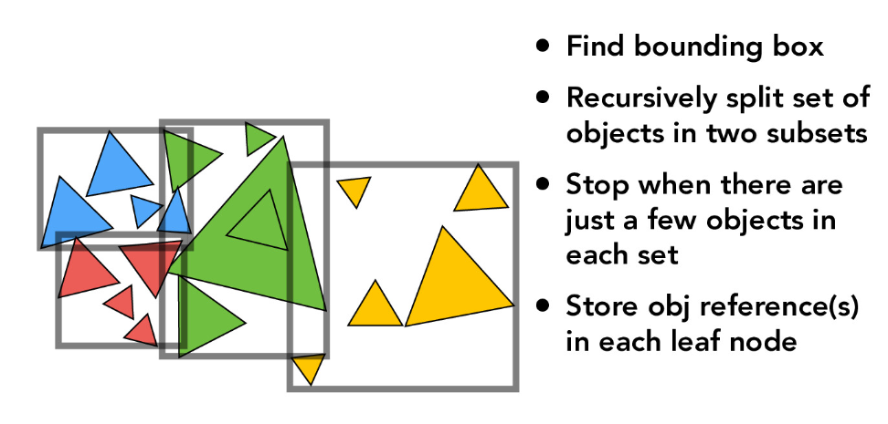
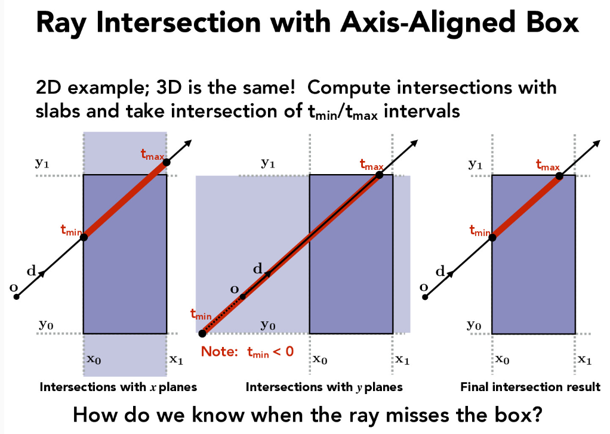
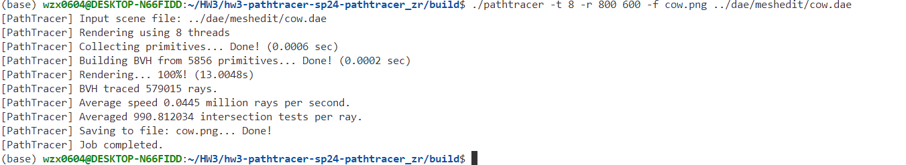
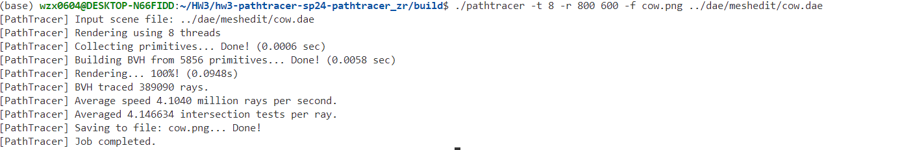
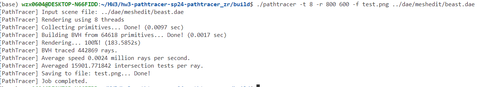
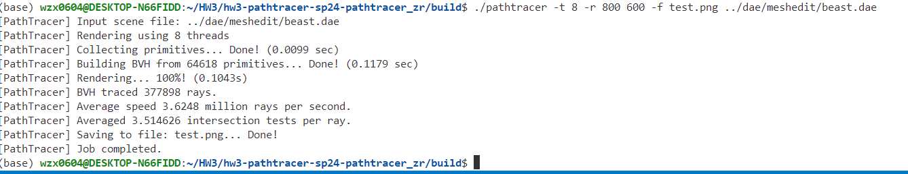
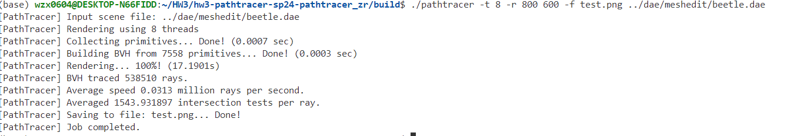
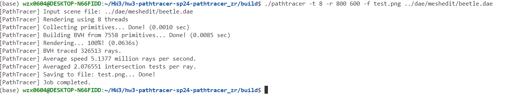

# Part 2: Bounding Volume Hierarchy

## Constructing the BVH

### Methodology

The method I use to construct the BVH (Bounding Volume Hierarchy) is based on splitting at the centroid as the midpoint. The specific choice of the splitting axis is completely random. This ensures that, in the vast majority of cases, the range of leaves will not be too flat.

The specific steps are as follows:

1. Select Split Axis: Randomly choose one from the $x$, $y$, $z$ axes as the split axis.
2. Calculate Centroid for Selected Axis: Find the position of the centroid along the selected axis
3. Sort Pointers According to Coordinates on Selected Axis: Arrange the pointers at this point in order of their corresponding coordinates along the selected axis, from smallest to largest.
4. Splitting Nodes: The left subtree contains the first half of the pointers. The right subtree contains the second half of the pointers. Recur this process until the maximum value of nodes is reached.



### Implementation

Determine whether the $max_leaf_size$ has been reached.

```cpp
if (end - start + 1 <= max_leaf_size){
    node->start = start;
    node->end = end;
    node->l = node->r = NULL;
    return node;
    }
```

Randomly choose one axis. 0 for x, 1 for y and 2 for z.
```cpp
int axis=rand()%3;
```

Sort pointers according to coordinates on the selected axis.

```cpp
  std::sort(start, end, [axis](Primitive *a, Primitive *b)
    { return a->get_bbox().centroid()[axis] < b->get_bbox().centroid()[axis]; });
```

Splitting nodes.

```cpp
  left_end = start + (end - start) / 2;
  right_start = left_end;
  node->l = construct_bvh(start, left_end, max_leaf_size);
  node->r = construct_bvh(right_start, end, max_leaf_size);
```
## Intersecting the Bounding Box

For most situations: Check the entry and exit times. If the entry time and exit time are in the range between t0 and t1, return True. In addition, the entry time is the maximum of the entry times along each axis, and the exit time is the minimum of the exit times along each axis.
Otherwise, return False.



Special Case 1:

If the ray is parallel to one or more axes, let it(or one of them) as axis m.
If the value of axis m at the starting position of the ray is within the range of the node, then consider the entry time as negative infinity and the exit time as positive infinity at axis m.
Otherwise, return False.

Special Case 2:
If the origin of the ray is inside the bounding box, return True.

Special Case 3:
If the ray stops in the bounding box, return True.

### Implementation

Consider the common situations and the Special Case 1.
t[/][0] means the enter time at axis /.
t[/][1] means the exit time at axis /.
t[0] means axis x. Similarly, t[1] for y and t[2] for z.

```cpp
  double t[3][2];
  if(r.d.x==0){
    if(r.o.x<min.x||r.o.x>max.x)return false;
    t[0][0]=-99999;
    t[0][1]=999999;
  }
  else{
    t[0][0]=std::min((min.x-r.o.x)/r.d.x,(max.x-r.o.x)/r.d.x);
    t[0][1]=std::max((min.x-r.o.x)/r.d.x,(max.x-r.o.x)/r.d.x);
  }
  if(r.d.y==0){
    if(r.o.y<min.y||r.o.y>max.y)return false;
    t[0][0]=-99999;
    t[0][1]=999999;
  }
  else{
    t[1][0]=std::min((min.y-r.o.y)/r.d.y,(max.y-r.o.y)/r.d.y);
    t[1][1]=std::max((min.y-r.o.y)/r.d.y,(max.y-r.o.y)/r.d.y);
  }
  if(r.d.z==0){
    if(r.o.z<min.z||r.o.z>max.z)return false;
    t[0][0]=-99999;
    t[0][1]=999999;
  }
  else{
    t[2][0]=std::min((min.z-r.o.z)/r.d.z,(max.z-r.o.z)/r.d.z);
    t[2][1]=std::max((min.z-r.o.z)/r.d.z,(max.z-r.o.z)/r.d.z);
  }
```
Initialize the entry and exit times as described earlier.

```cpp
  double t_enter = std::max(std::max(t[0][0], t[1][0]), t[2][0]);
  double t_exit = std::min(std::min(t[0][1], t[1][1]), t[2][1]);
```

Check if the intersection is in the range of t0 and t1

```cpp
  if (t_exit > t_enter && t_exit > 0)
  {
    if (t_enter > t0 && t_enter < t1)
    {
      t0 = t_enter;
      return true;
    }
  }
```
Consider the Special Case 2.

```cpp
  if (r.o.x >= min.x && r.o.x <= max.x && r.o.y >= min.y && r.o.y <= max.y && r.o.z >= min.z && r.o.z <= max.z)
  {
    return true;
  }
```
Consider the Special Case 3.

```cpp
  Vector3D end = r.o + r.d * r.max_t;
  if (end.x >= min.x && end.x <= max.x && end.y >= min.y && end.y <= max.y && end.z >= min.z && end.z <= max.z)
  {
    return true;
  }
```


## Intersecting the BVH

### Methodology

The core idea is as follows:
If it is not a leaf node, recursively check the left and right child nodes.
If it is a leaf node, use the function generated in the previous step to check for intersection.

### Implementation

#### BVHAccel:has_intersection

If it is a leaf node.

'''cpp
  if (node->isLeaf()){
    // check if the ray intersects with a bounding box of the node
    if (!node->bb.intersect(ray, t0, t1))return false;
    // has intersection, check all primitives in the node
    for (auto p = node->start; p != node->end; p++){
      total_isects++;
      if ((*p)->has_intersection(ray))return true;
      }
    return false;
    }
```
If it is not a leaf node, recursively check the left and right child nodes.

```cpp
  bool left_result, right_result;
  left_result = has_intersection(ray, node->l);
  right_result = has_intersection(ray, node->r);
```

#### BVHAccel:intersect

This is quite similar to the approach discussed earlier, so I will provide the code directly. More detailed explanations are provided in the comments.

```cpp
      double t0 = ray.min_t, t1 = ray.max_t;

      // check if current node is leaf node
      if (node->isLeaf())
      {
        // check if the ray intersects with bounding box of the node
        if (!node->bb.intersect(ray, t0, t1))
          return false;

        // has intersection, check all primitives in the node
        bool has_isect = false;
        for (auto p = node->start; p != node->end; p++)
        {
          total_isects++;
          if ((*p)->has_intersection(ray))
          {
            has_isect = true;

            // check the t value of the intersection
            Intersection temp_isect;
            (*p)->intersect(ray, &temp_isect);

            if (temp_isect.t < i->t)
            {
              i->t = temp_isect.t;
              i->primitive = temp_isect.primitive;
              i->n = temp_isect.n;
              i->bsdf = temp_isect.bsdf;
            }
          }
        }
        return has_isect;
      }

      // if current node is not leaf node
      // check if the ray intersects with bounding box of the node
      if (!node->bb.intersect(ray, t0, t1))
        return false;

      // has intersection, check left and right child
      bool left_result, right_result;
      left_result = intersect(ray, i, node->l);
      right_result = intersect(ray, i, node->r);
      // NEVER use 'return intersect(ray, i, node->l) || intersect(ray, i, node->r);'
      // because the right child might not be checked if the left child has intersection
      return left_result || right_result;
```

## Result

Images with normal shading for a few large .dae files that I can only render with BVH acceleration.


I will compare running the following code with and without building the BVH:

```cpp
  ./pathtracer -t 8 -r 800 600 -f cow.png ../dae/meshedit/cow.dae
```
Without BVH:



It costs about 13s.

With BVH:



It costs less than 1s.

For the other images:
### beast.dae
                without


              
                with



### beetle.dae 

                without


              
                with
                



Summary: Using BVH can be nearly a thousand times faster compared to not using it. For example, rendering beast.dae without BVH takes 3 minutes, while using BVH takes less than half a second. The reason for this is that this structure reduces the number of intersection tests needed to find the intersection between a ray and an object in the scene.


