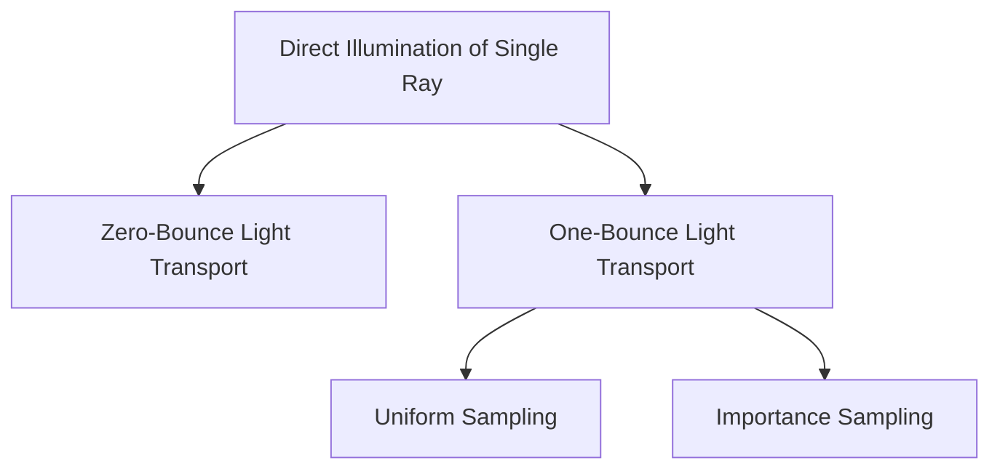
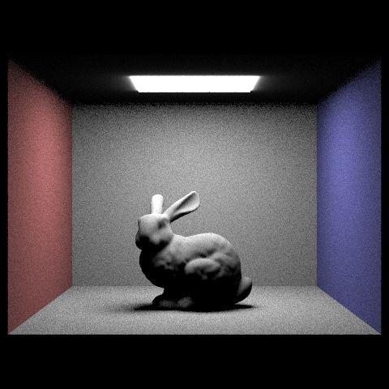
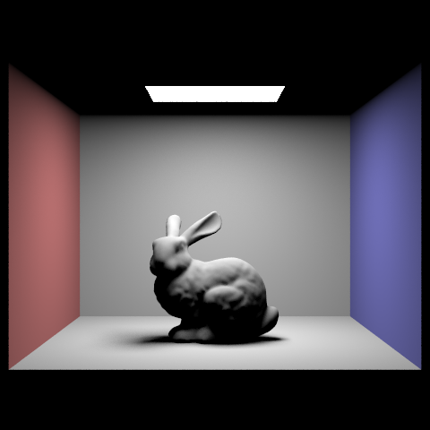
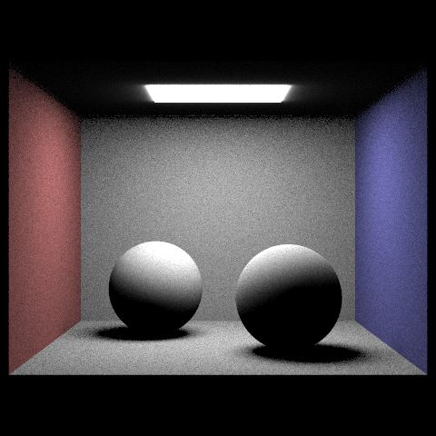
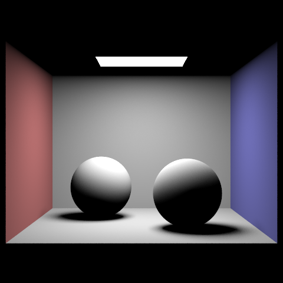
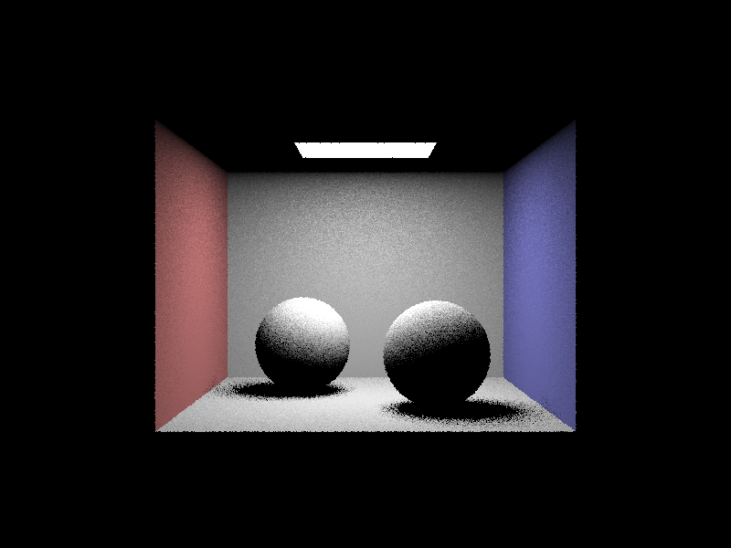
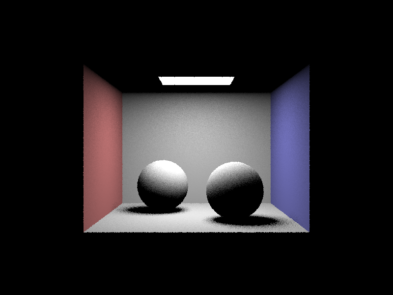

# Part3: Direct Illumination

## Overview

Global illumination radiance from direct illumination is estimated in this part. The direct illumination consists of zero-bounce and one-bounce light transport, and the latter could be estimated by uniformly sampling the hemisphere or importance sampling the BRDF. The structure of the pipeline is as follows:



The above sections will be explained in detail in the following sections.

## Zero-Bounce Illumination

### Methodology

Zero-bounce illumination of a single ray is estimated by adding the emitted radiance from the light sources to the pixel color. The emitted radiance here only considers the light sources and does not consider the indirect illumination from the scene. The rendering equation for zero-bounce illumination is given by:

$$
L_o(p, \omega_o) = L_e(p, \omega_o)
$$

where $L_o(p, \omega_o)$ is the radiance leaving the point $p$ in the direction $\omega_o$, and $L_e(p, \omega_o)$ is the emitted radiance from the light sources.

### Implementation

In the starter code, the emitted radiance from the intersected light source of the ray is encapsulated in `BSDF::get_emission()`. The emitted radiance is added to the pixel color and returned:

```cpp
    // obtain the emission color of the intersection
    Vector3D L_out = isect.bsdf->get_emission();
    
    return L_out;
```

## Uniform Hemisphere Sampling

### Methodology

In physical-based rendering, the reflected radiance from the surface is calculated by integrating the product of the BRDF and the incident radiance over the hemisphere:

$$
L_o(p, \omega_o) = \int_{\Omega} f(p, \omega_i, \omega_o) L_i(p, \omega_i) \cos(\theta_i) d\omega_i
$$

where $L_o(p, \omega_o)$ is the radiance leaving the point $p$ in the direction $\omega_o$, $f(p, \omega_i, \omega_o)$ is the BRDF, $L_i(p, \omega_i)$ is the incident radiance from the direction $\omega_i$, and $\theta_i$ is the angle between the normal and the incident direction. 

The integral is approximated by sampling the hemisphere uniformly and averaging the results using Monte Carlo integration:

$$
L_o(p, \omega_o) \approx \frac{1}{N} \sum_{i=1}^{N} f(p, \omega_i, \omega_o) L_i(p, \omega_i) \cos(\theta_i)
$$

where $N$ is the number of samples. For uniform sampling, the possibility function is given by:

$$
p(\omega_i) = \frac{1}{2\pi}
$$

The incident radiance can be obtained by zero-bounce illumination, and $\cos(\theta_i)$ is the dot product between the normal and the incident direction.

The uniform hemisphere sampling calculates $L_o(p, \omega_o)$ by sampling the hemisphere uniformly and averaging to produce the final result.

### Implementation

First, a random direction is sampled in the hemisphere space, and its corresponding vector in world space is also prepared to calculate $\cos(\theta_i)$:

```cpp
      // sample a random direction in the hemisphere
      wi_sample_o = hemisphereSampler->get_sample();

      // transform the sample to world space
      wi_sample_w = o2w * wi_sample_o;
      wi_sample_w.normalize();
      // find cos_theta, which is the dot product of the sample direction and the normal
      cos_theta = dot(wi_sample_w, isect.n) / wi_sample_o.norm() / isect.n.norm();
```

Then a sample ray is generated in the direction of the sampled vector, and the incident radiance is calculated by zero-bounce illumination if the ray intersects with the scene:

```cpp
      // find the light coming from the sample direction
      // first construct a ray from the hit point to the sample direction
      ray = Ray(hit_p, wi_sample_w);
      ray.min_t = EPS_F;
      Intersection sample_isect;

      // then check if the ray intersects with any object
      if (bvh->intersect(ray, &sample_isect))
      {

        // use zero bounce radiance to calculate the light coming from the sample direction
        wi_sample_incoming_light = zero_bounce_radiance(ray, sample_isect);
      }
      else
      {
        // else there's no light coming from the sample direction
        wi_sample_incoming_light = Vector3D(0, 0, 0);
      }
```

Finally, the partial result is calculated with Monte Carlo integration and added to the pixel color:

```cpp
      // for uniform sampling, the probability of each sample is 1 / (2 * PI)
      // now put everything together
      L_out += (1.0 / (double)num_samples) * (cos_theta * isect.bsdf->f(w_out, wi_sample_o) * wi_sample_incoming_light * (2 * PI));
```

This process is repeated for `num_samples` times, and the final result is returned.

## Importance Sampling

### Methodology

Unlike uniform sampling, importance sampling only samples in the direction of light sources. The Monte Carlo integration is also implemented. The render equation is the same as the uniform sampling, but the possibility function is different.

### Implementation

The importance sampler will iterate through all the light sources in the scene. Each light source is first checked if it is a delta light(point light source), this is because the result of a point light source is deterministic and only needs to be calculated once. The area light sources are sampled based on their area, a `num_total_samples` is maintained to perform the normalizing step in the Monte Carlo integration.

```cpp
      // sample the light
      if (light->is_delta_light())
      {
        num_samples = 1;
      }
      else
      {
        num_samples = ns_area_light;
      }
      num_total_samples += num_samples;
```

For each sample of each light source, the starter code provides the `sample_L` function to sample as well as calculates the possibility function.

```cpp
      // sample the light
      for (int i = 0; i < num_samples; i++)
      {
        wi_sample_incoming_light = light->sample_L(hit_p, &wi_sample_w, &dist_to_light, &pdf);
```

Again, a ray is generated in the sample direction. However, in importance sampling it is checked that the ray does not hit anything until it reaches the light source.

```cpp
        // generate a ray from the hit point to the light, check if it hit anything
        ray = Ray(hit_p, wi_sample_w);
        ray.min_t = EPS_F;
        ray.max_t = dist_to_light - EPS_F; // don't forget to subtract EPS_F to avoid self-intersection

        if (bvh->has_intersection(ray))
        {
          continue;
        }
```

If the ray does not hit anything, the partial result is calculated the same way as in uniform sampling and added to the pixel color.

```cpp
        // calculate cos_theta
        cos_theta = dot(wi_sample_w, isect.n) / wi_sample_w.norm() / isect.n.norm();
        // calculate the sample direction in object space
        wi_sample_o = w2o * wi_sample_w;

        // put everything together
        L_out += (cos_theta * isect.bsdf->f(w_out, wi_sample_o) * wi_sample_incoming_light) / pdf;
```

Finally, the result is normalized by `num_total_samples` and returned.

## One-Bounce Illumination and Direct Illumination
One-Bounce Illumination function calls different sampling methods based on user selection:

```cpp
  Vector3D PathTracer::one_bounce_radiance(const Ray &r,
                                           const Intersection &isect)
  {
    // TODO: Part 3, Task 3
    // Returns either the direct illumination by hemisphere or importance sampling
    // depending on `direct_hemisphere_sample`

    // Implementation by Ruhao Tian starts here

    if (direct_hemisphere_sample)
    {
      return estimate_direct_lighting_hemisphere(r, isect);
    }
    else
    {
      return estimate_direct_lighting_importance(r, isect);
    }
  }
```

The direct illumination is estimated by adding the zero-bounce and one-bounce illumination to the pixel color:

```cpp
    // add direct illumination to L_out
    L_out += zero_bounce_radiance(r, isect);

    // TODO (Part 3): Return the direct illumination.
    // add one bounce radiance to L_out
    L_out += one_bounce_radiance(r, isect);
```

## Results

The following images show the results of the direct illumination with uniform sampling and importance sampling.

**CBbunny.dae**

Uniform Sampling



Importance Sampling



**CBspheres_lambertian.dae**

Uniform Sampling



Importance Sampling



From the images, it can be observed that the importance sampling produces a smoother result than the uniform sampling. This is because, given the same amount of samples per pixel and per light source, the importance sampling will concentrate more samples on the light sources, which is more efficient than uniformly sampling the hemisphere. Uniform sampling, on the other hand, will waste samples on the directions that do not contribute to the final result, which is why the result is noisier.

The following images are the results of the importance sampling with 1, 4, 16, and 64 light rays and 1 sample per pixel of the `CBspheres_lambertian.dae` scene.

{width=49%}
{width=49%}
{width=49%}
{width=49%}

According to the images, the result becomes smoother as the number of light rays increases. This is because the more light rays are sampled, the more accurate the result will be. However, the result will also be more noisy if the number of samples per pixel is low. This is why the result is still noisy with 64 light rays and 1 sample per pixel. The result will be smoother if the number of samples per pixel is increased, but it will also be more computationally expensive. Therefore, the number of samples per pixel should be chosen based on the trade-off between the quality of the result and the computational cost.