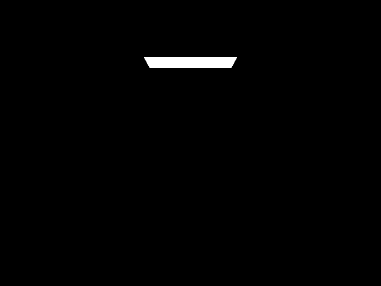
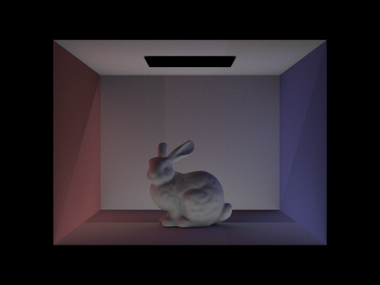
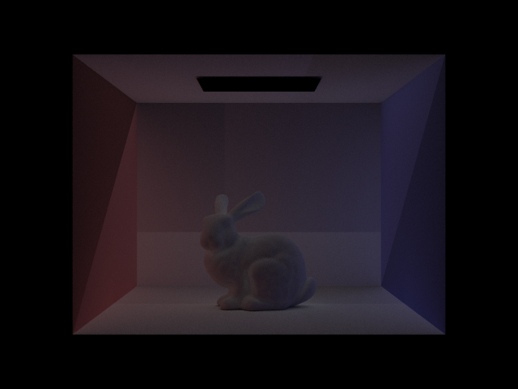
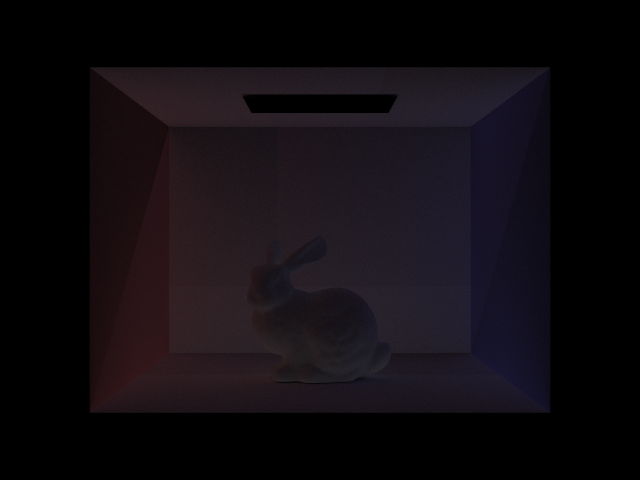
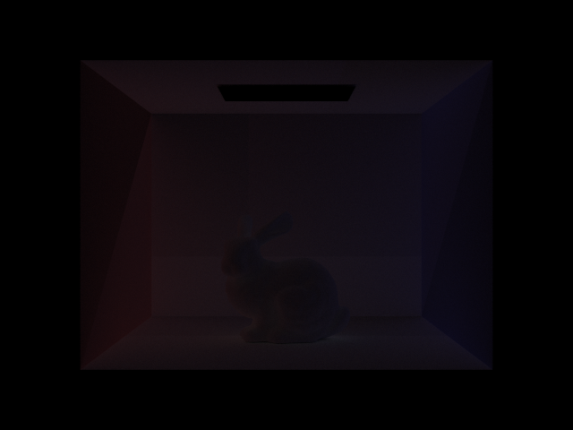
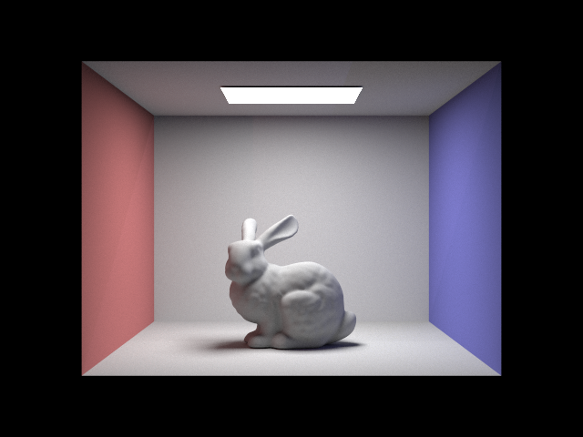

# Part4: Global Illumination

## Sampling with Diffuse BSDF

### Methodology

Using $sampler.get_sample(pdf)$, a random sample direction is obtained from the cosine-weighted hemisphere distribution. Next, the obtained sample direction $wi$ is used as the incoming light direction, and the $f$ function is called to compute the BSDF evaluation of the diffuse material at $(wo, *wi)$.

### Implementation

The function $f$ is defined in Part 3.

```cpp
  *wi = sampler.get_sample(pdf);
  return f(wo, *wi);
```
## Global Illumination with up to N Bounces of Light

### Methodology

The following is the rendering equation.


Simplify:


Solve the equation:


### Implementation

#### at_least_one_bounce_radiance

If $r.depth == max_ray_depth - 1$, this means the maximum depth has been reached. L_out just needs to add the value of this diffuse reflection, which is the function $one_bounce_radiance$.

```cpp
  if (isAccumBounces || r.depth == max_ray_depth - 1)
    {
      L_out += one_bounce_radiance(r, isect);
    }
```
Check if the maximum depth is reached. If true, return the L_out. Otherwise, continue operating the rest of the code.

```cpp
  if (r.depth >= max_ray_depth - 1)
    {
    return L_out;
    }
```

Now, calculate the radiance from extra bounces. First, obtain a ray from the hit point to the sample direction. 

```cpp
  Vector3D wi_sample_o, wi_sample_w;
  double pdf;
  Vector3D wi_sample_incoming_light;
  Ray ray;
  Intersection isect_light;
  // sample the next direction
  isect.bsdf->sample_f(w_out, &wi_sample_o, &pdf);
  // transform the sample direction to object space
  wi_sample_w = o2w * wi_sample_o;
  // generate a ray from the hit point to the sample direction
  double cos_theta = dot(wi_sample_w, isect.n) / wi_sample_w.norm() / isect.n.
    norm();
  ray = Ray(hit_p, wi_sample_w);
  ray.depth = r.depth + 1;
  ray.min_t = EPS_F;
```

Next, recurse this equation until reaching max_ray_depth(this was checked before).

```cpp
  if (bvh->intersect(ray, &isect_light))
  {
    // calculate the radiance from the extra bounces
    L_out += (isect.bsdf->f(w_out, wi_sample_o) * at_least_one_bounce_radiance    (ray, isect_light) * cos_theta / pdf);
  }
```

#### est_radiance_global_illumination

Just need to accumulate the result each time.

```cpp
  if (max_ray_depth > 0)
    {
      L_out += at_least_one_bounce_radiance(r, isect);
    } 
```
## Global Illumination with Russian Roulette

### Methodology

Now we have set a probability between 0.3 and 0.4 (implemented as 0.35) as the probability for early termination. Due to the influence of probability, we need to normalize the result. The core idea is shown in the diagram below.


### Implementation

We just need to make some small adjustments to the function $at_least_one_bounce_radiance$. The adjusted code is as follows.

First, set the possibility.

```cpp
  double possibility = 0.35;
```
Next, check whether to terminate early.

```cpp
  if (bvh->intersect(ray, &isect_light) && coin_flip(possibility)){

  //Here, a lot of code has been omitted.

  return L_out;
  }
```

At last, normalize. Note that the code below has an additional parameter $probability$.

```cpp
  L_out += (isect.bsdf->f(w_out, wi_sample_o) * at_least_one_bounce_radiance(ray, isect_light) * cos_theta / pdf) / possibility;
```

Finally, here is the overall code. This is very similar to the previous section, so you don't need to pay too much attention to these codes.

```cpp
  if (isAccumBounces || r.depth == max_ray_depth - 1)
    {
      L_out += one_bounce_radiance(r, isect);
    }

  // check if the maximum depth is reached
  if (r.depth >= max_ray_depth - 1)
    {
      return L_out;
    }

  // if not, calculate the radiance from extra bounces
  Vector3D wi_sample_o, wi_sample_w;
  double pdf;
  Vector3D wi_sample_incoming_light;
  Ray ray;
  Intersection isect_light;
  // sample the next direction
  isect.bsdf->sample_f(w_out, &wi_sample_o, &pdf);
  // transform the sample direction to object space
  wi_sample_w = o2w * wi_sample_o;
  // generate a ray from the hit point to the sample direction
  double cos_theta = dot(wi_sample_w, isect.n) / wi_sample_w.norm() / isect.n.norm();
  ray = Ray(hit_p, wi_sample_w);
  ray.depth = r.depth + 1;
  ray.min_t = EPS_F;
  if (bvh->intersect(ray, &isect_light) && coin_flip(possibility))
    {
    // calculate the radiance from the extra bounces
    L_out += (isect.bsdf->f(w_out, wi_sample_o) * at_least_one_bounce_radiance(ray, isect_light) * cos_theta / pdf) / possibility;
    }
  return L_out;
```
## Results

### Here are some direct and indirect illumination.

### Direct


### Indirect(only sum m=2,3,4,5)


### Compare


We can find that the direct illumination is more smooth and lighter than the indirect one.

### Here are the results for rendering the mth bounce of light with max_ray_depth set to 0, 1, 2, 3, 4, and 5, and isAccumBounces=false, for CBbunny.dae

### m=0



### m=1


### m=2



### m=3



### m=4



### m=5



### Reason

This is because each time the light reflects off a surface, some of its energy is absorbed or scattered, leading to an overall decrease in brightness with each subsequent bounce. As the number of reflections increases for the second and third bounces of light, the intensity of light diminishes, resulting in the images becoming progressively darker. 

The main reason it improves the quality of rendered images is that multiple reflections simulate the paths of real light in the physical world, making the images more closely resemble what we see in reality. This enhances the realism of the images. For example, multiple reflections result in more accurate and realistic shadows, which contribute to a more lifelike appearance.

### Here are the results for rendered views with max_ray_depth set to 0, 1, 2, 3, 4, and 5  for CBbunny.dae

### m=0


### m=1


### m=2



### m=3


### m=4


### m=5


### Compare

We can find that as m increases, the picture becomes brighter and brighter.

### Here are the results for outputing the Russian Roulette rendering with max_ray_depth set to 0, 1, 2, 3, 4, and 100  for CBbunny.dae

### m=0


### m=1


### m=2


### m=3


### m=4


### m=100


### The following are rendering pictures of the same scene with different sampling rates.

### sample-per-pixel rate=1


### sample-per-pixel rate=2


### sample-per-pixel rate=4


### sample-per-pixel rate=8


### sample-per-pixel rate=16


### sample-per-pixel rate=64


### sample-per-pixel rate=1024


### Compare

As the sample-per-pixel rate increases, the image will become smoother and smoother. At the same time, the brightness will also increase slightly.

