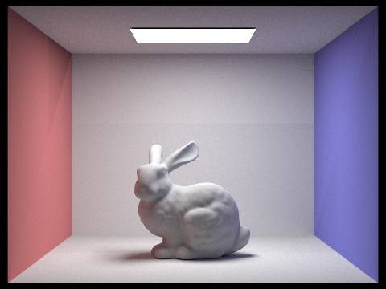
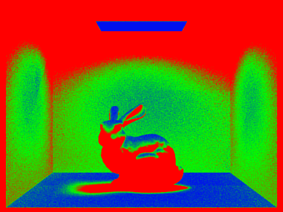
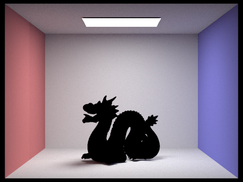
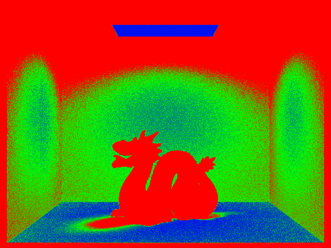

# Part5: Adaptive Sampling

## Methodology

The high-level idea of adaptive sampling is to reduce the sampling number of pixels that converge to a certain color quickly and focus on the pixels that take longer to converge. A variable $I$ is maintained to measure the convergence of the pixel:

$$
I = 1.96 \frac{\sigma}{\sqrt{n}}
$$

where $\sigma$ is the standard deviation of the pixel color samples, and $n$ is the number of samples.

$I$ decreases as the number of samples increases and the standard deviation decreases. When $I$ is less than a certain threshold, the pixel is considered to have converged, and the sampling process stops. The threshold is given by:

$$
I_{\text{threshold}} = \text{maxTolerance} \times \mu
$$

where $\mu$ is the mean of the pixel color samples, and $\text{maxTolerance}$ is a user-defined parameter, which is set to 0.05 by default.

## Implementation

To calculate convergence, two variables `total_illumination` and `total_illumination_squared` are maintained:

$$
\begin{aligned}
\text{total_illumination} &= \sum_{k=1}^{n} x_{k} \\
\text{total_illumination_squared} &= \sum_{k=1}^{n} x_{k}^{2}
\end{aligned}
$$

where $x_{k}$ is the illumination of sample $k$.

For one sample, first, the normal sample process mentioned in Part1 is executed:

```cpp
        // generate a random sample
        current_sample = gridSampler->get_sample();
        // don't forget to normalize the sample
        xsample_normalized = ((double)x + current_sample.x) / sampleBuffer.w;
        ysample_normalized = ((double)y + current_sample.y) / sampleBuffer.h;
        // generate a random ray
        current_ray = camera->generate_ray(xsample_normalized, ysample_normalized);
        // trace the ray
        current_radiance = est_radiance_global_illumination(current_ray);
        L_out += current_radiance;
```

After the normal sample process, the illumination of the current sample is added to `total_illumination`` and `total_illumination_squared`:

```cpp
        current_illumination = current_radiance.illum();
        total_illumination += current_illumination;
        total_illumination_squared += current_illumination * current_illumination;
```

For more efficient processing, the convergence is tested every `samplesPerBatch` samples:

```cpp
        if (i % samplesPerBatch == 0)
        {
          // check convergence of the pixel
          mean = total_illumination / (i + 1);

          deviation = sqrt((total_illumination_squared - (i + 1) * mean * mean) / i);

          I = 1.96 * deviation / sqrt(i + 1);

          if (I < maxTolerance * mean)
          {
            break;
          }
        }
```

If the pixel color is difficult to converge, it is sampled at most `ns_aa` time, which is the sample number in normal sampling in Part 1.

After the sample process is finished, total radiance `L_out` is normalized by the actual sample time `i` and assigned to the sample buffer:

```cpp
      // take the average of all the samples
      L_out /= i + 1;
      // update the sample buffer
      sampleBuffer.update_pixel(L_out, x, y);
      sampleCountBuffer[x + y * sampleBuffer.w] = i + 1;
```

## Result

The following figures are two scenes rendered with 2048 samples per pixel, a max ray depth of 5 and 1 sample per light.

**CBbunny.dae**

Render result



Sample rate image



**CBdragon.dae**

Render result



Sample rate image

