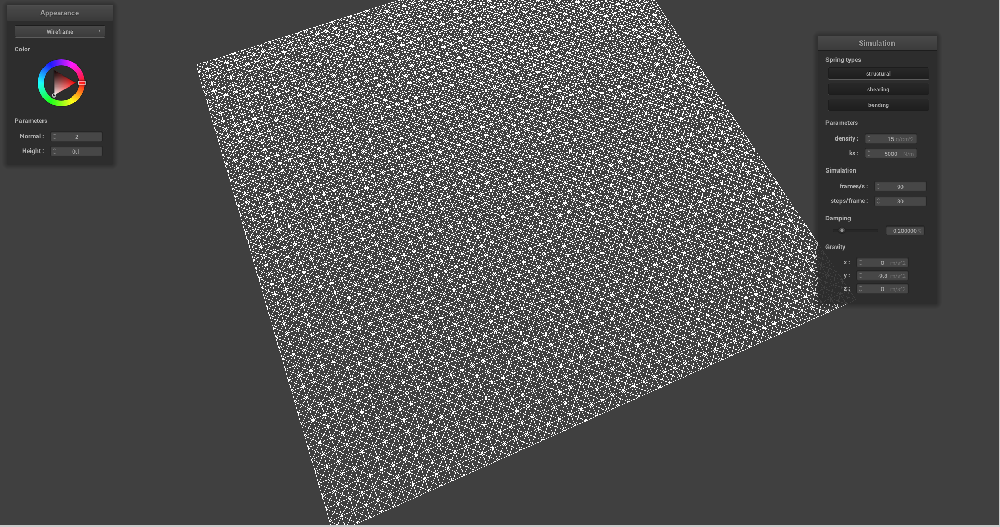
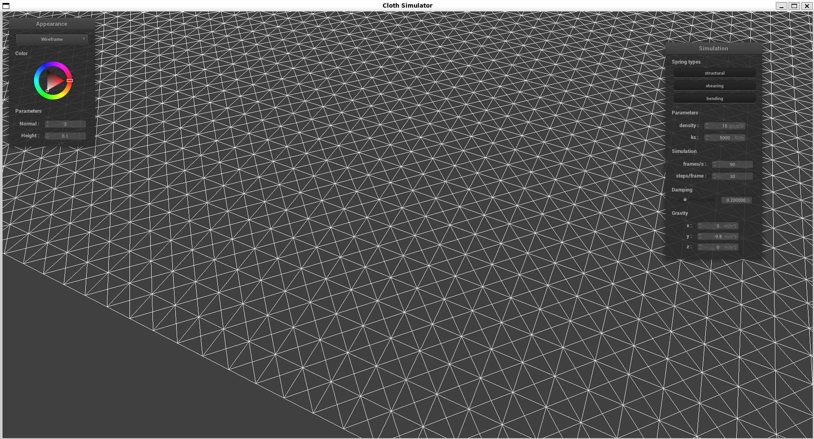
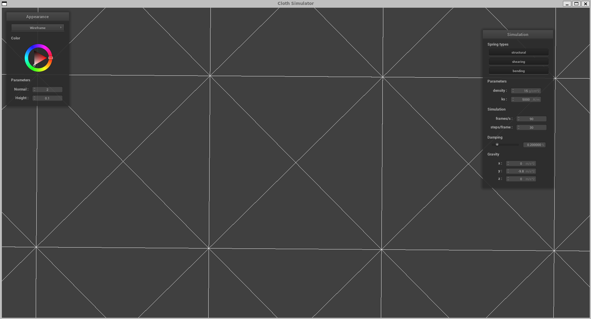
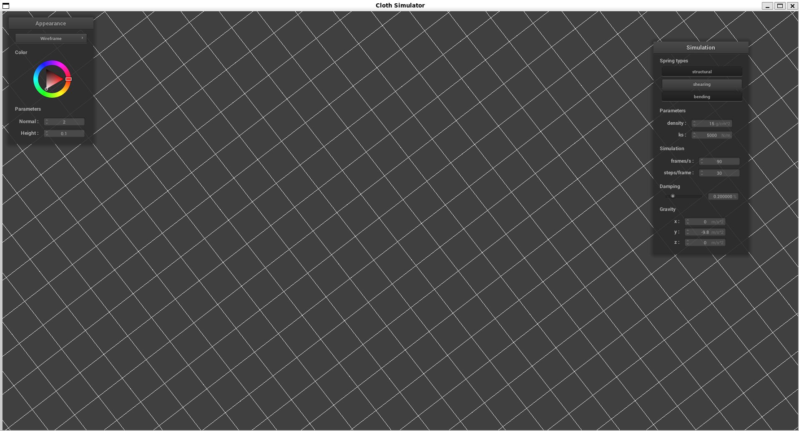
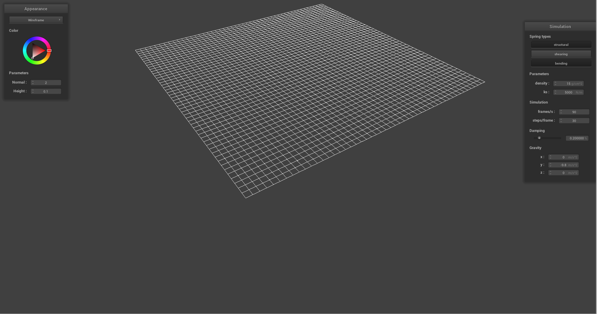
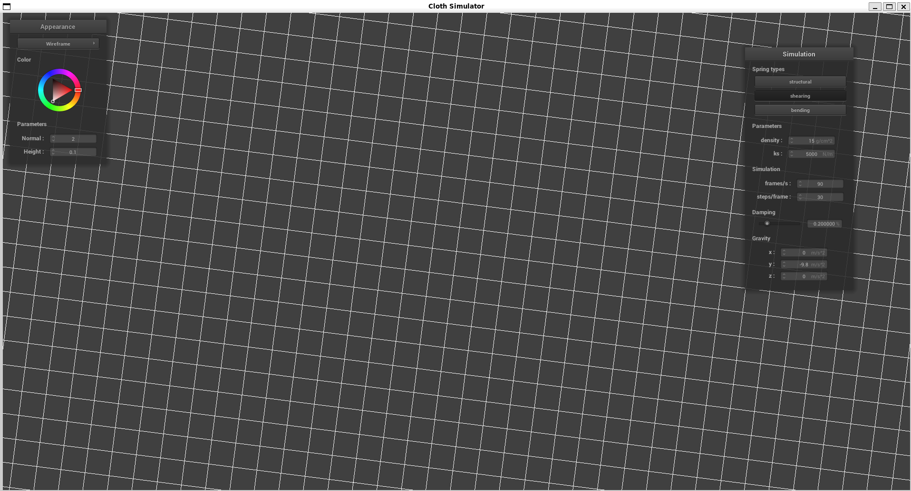
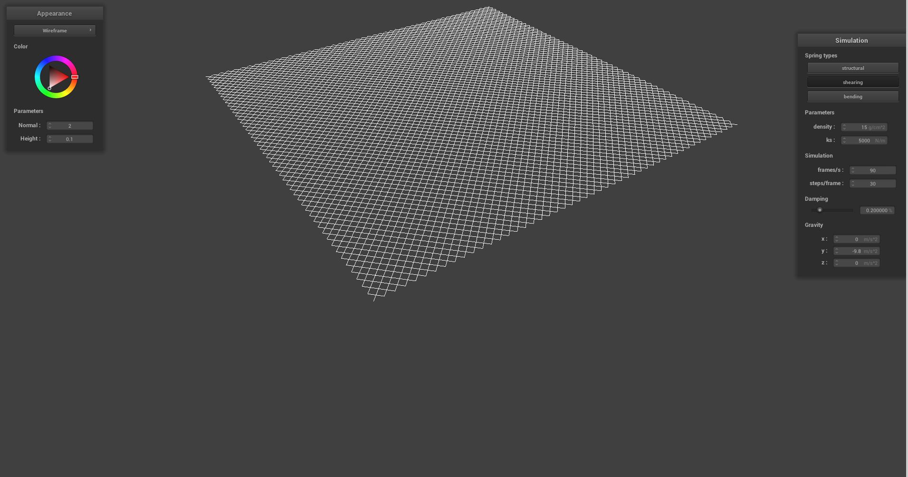
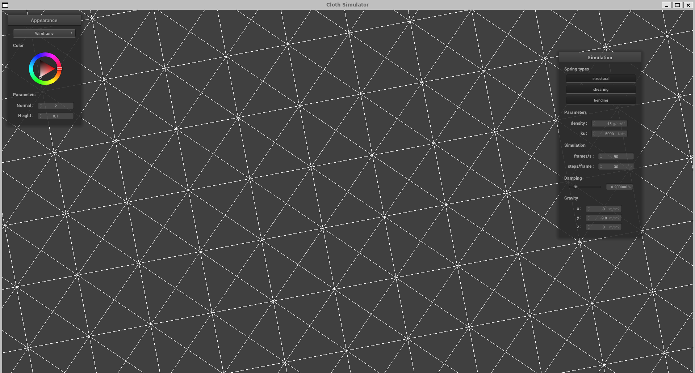
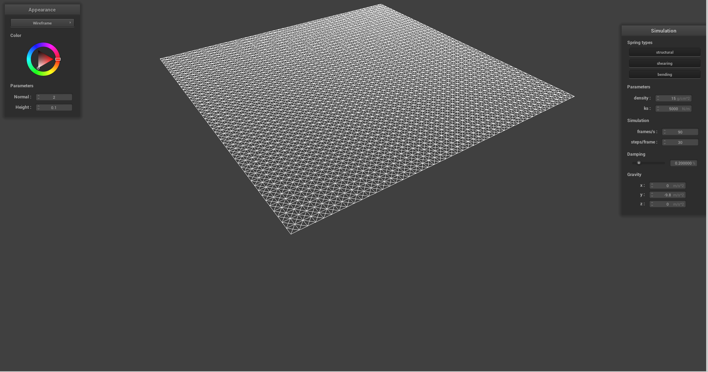

# Part 1: Masses and springs

## Results

Note: The blurriness comes from the low resolution of the screenshot.
The following images show the result of scene/pinned2.json at default parameters:

{ width=49% }

{ width=49% }

{ width=49% }

**Without any shearing constraints**

{ width=49% }

{ width=49% }

**With only shearing constraints**

{ width=49% }

{ width=49% }

**With all constraints**

{ width=49% }

{ width=49% }
