# Part 2: Simulation via numerical integration

Note: The units of the following data are all default units.

## Changing the spring constant ks

**ks=50000**

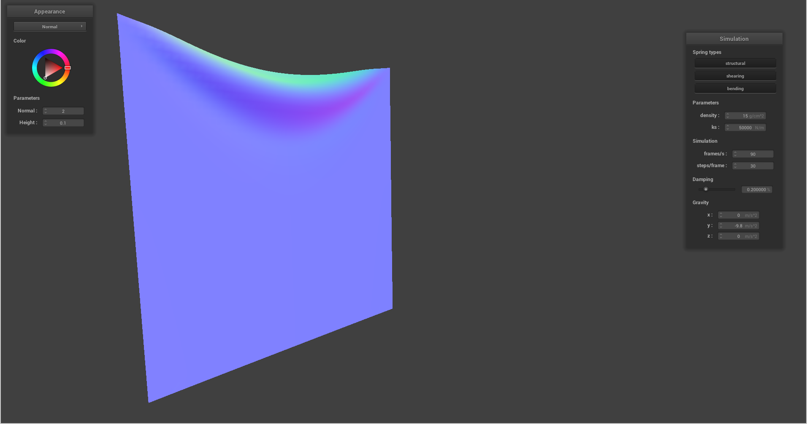{ width=49% }

**ks=5000**

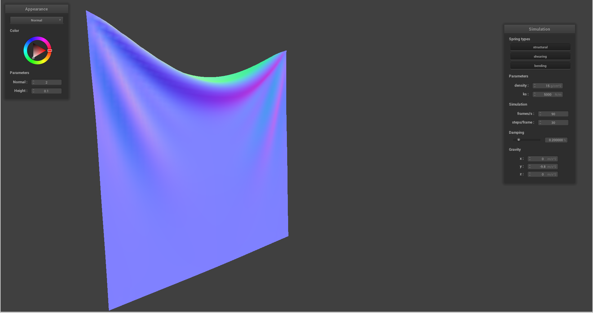{ width=49% }

**ks=500**

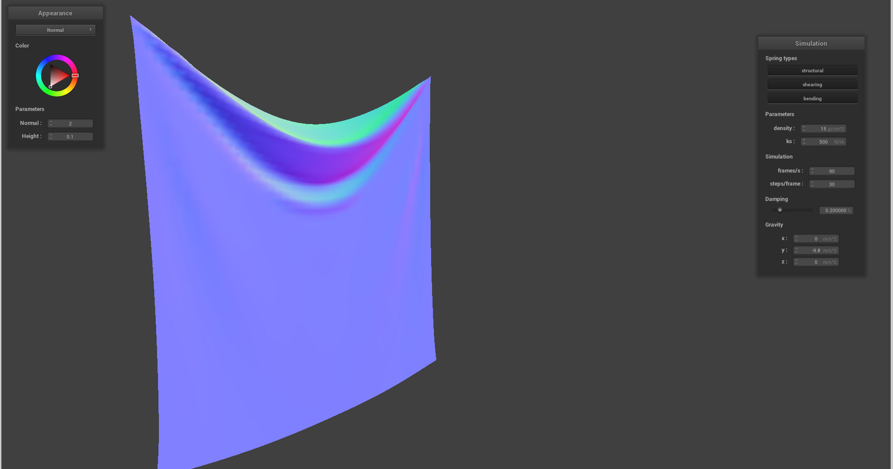{ width=49% }

Description: 
All these pictures are taken when the cloth becomes static. As ks increases,
the spring becomes more difficult to extend and compress. This will cause the fabric to feel tighter. In the picture, it is obvious that the lowest point in the middle of the fabric has been decreasing, and the wrinkles have also increased. Not only that, the acceleration of the cloth will also increase (in the same posture).

## Changing the density

**density=150**

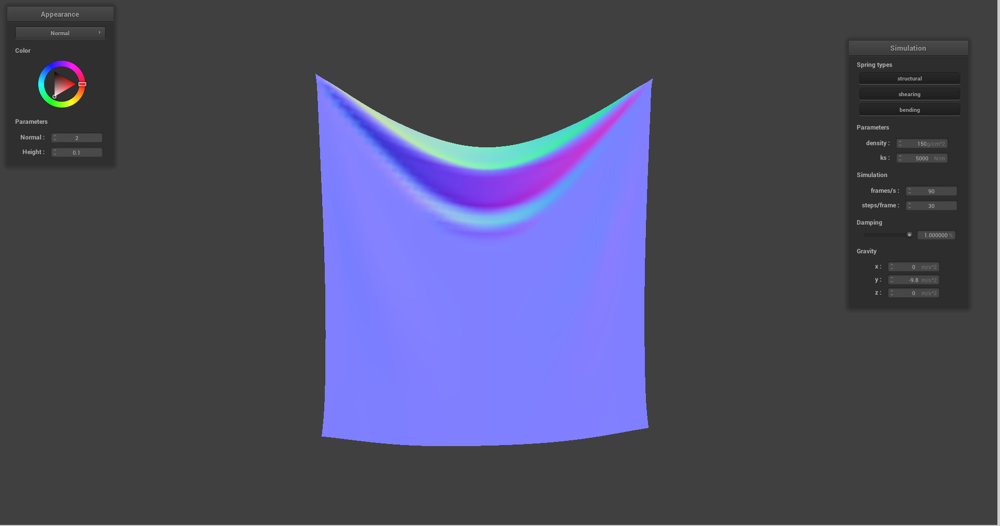{ width=49% }

**density=15**

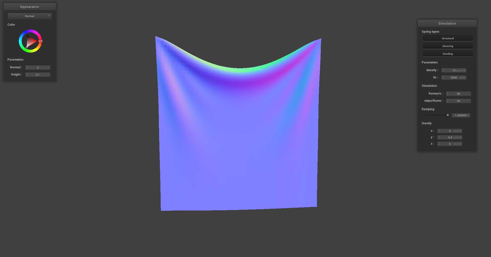{ width=49% }

**density=1.5**

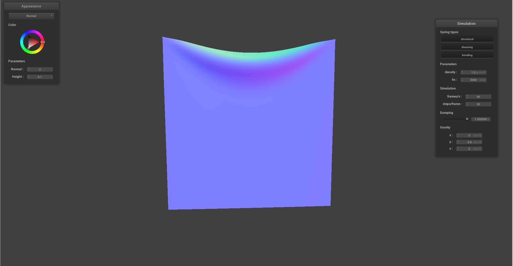{ width=49% }

Description:
All these pictures are taken when the cloth becomes static. The effect of changing this parameter is the same as changing ks (in the case of Part 2, i.e. collisions are not considered). Because density is proportional to gravity, gravity is equal to the change of the spring times ks. Therefore, as the density increases, the center becomes lower and lower, and there are more and more wrinkles. Not only that, the acceleration of the cloth will also increase (in the same posture)

## Changing the damping

**damping approximately equal to 0.9, time= 10s**

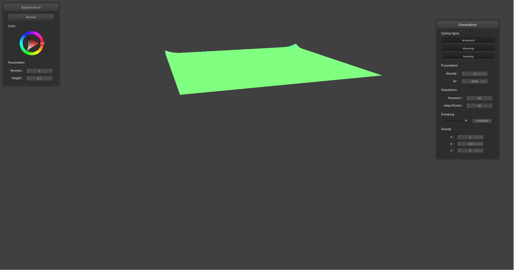{ width=49% }

**damping approximately equal to 0.5, time= 10s**

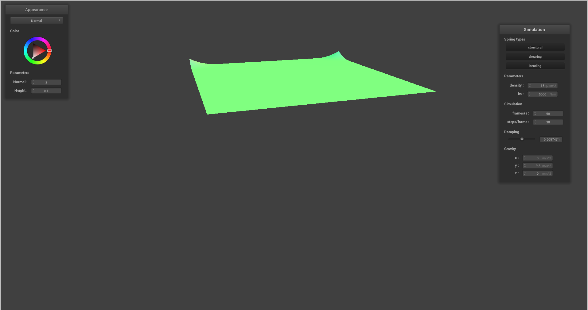{ width=49% }

**damping approximately equal to 0.1, time= 10s**

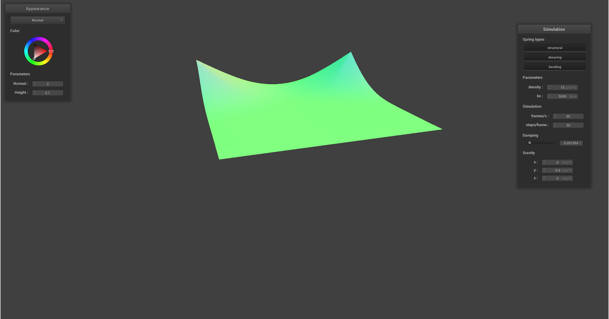{ width=49% }

**damping = 0**

{ width=49% }

**The following are two images representing arbitrary damping when the cloth is still and does not change.**

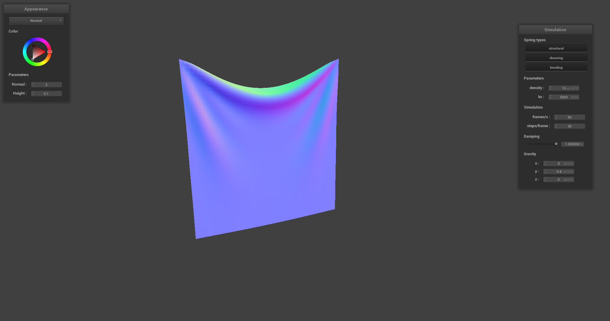{ width=49% }

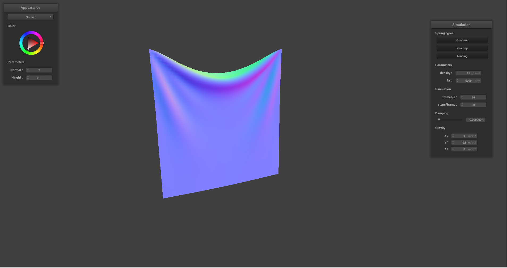{ width=49% }

Description:
The three pictures above are images of the cloth running from the initial state for 10 seconds. Obviously, the smaller the damping, the faster the cloth will fall. The two pictures below show that when the object is stationary, changing the damping will have no effect (after all, it is not moving). The special case is that the damping is 0. The cloth will never stop due to energy conservation.

## scene/pinned4.json in its final resting state

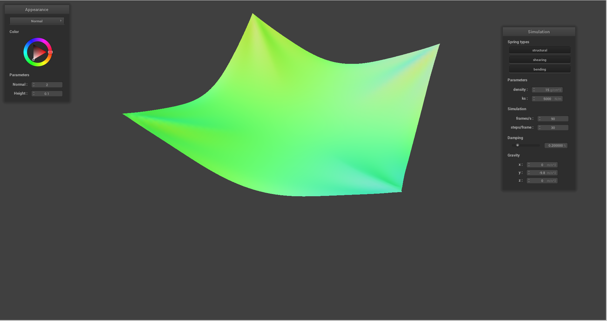{ width=49% }

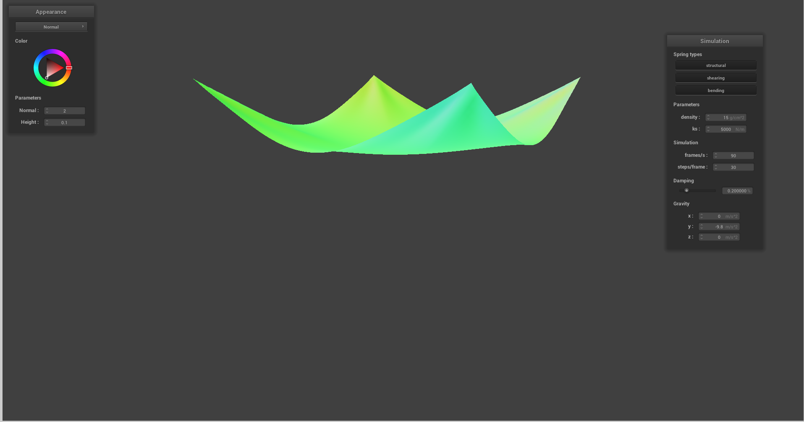{ width=49% }
