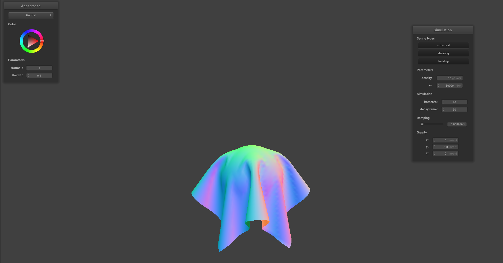

# Part 3: Handling collisions with other objects

Note: The units of the following data are all default units.

## scene/sphere.json in its final resting state

**ks=50000**

{ width=49% }

**ks=5000**

{ width=49% }

**ks=500**

{ width=49% }

Description:
This is because as the spring constant ks increases, the spring becomes harder to extend (or compress). This results in the fabric appearing tighter. The most noticeable effect is that as ks increases, the lowest point of the fabric rises.

## Shaded cloth lying peacefully at rest on the plane

{ width=49% }