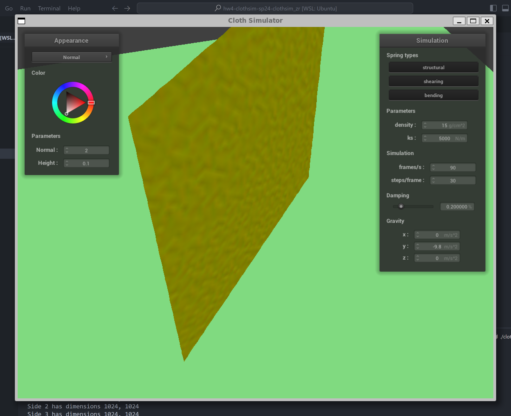
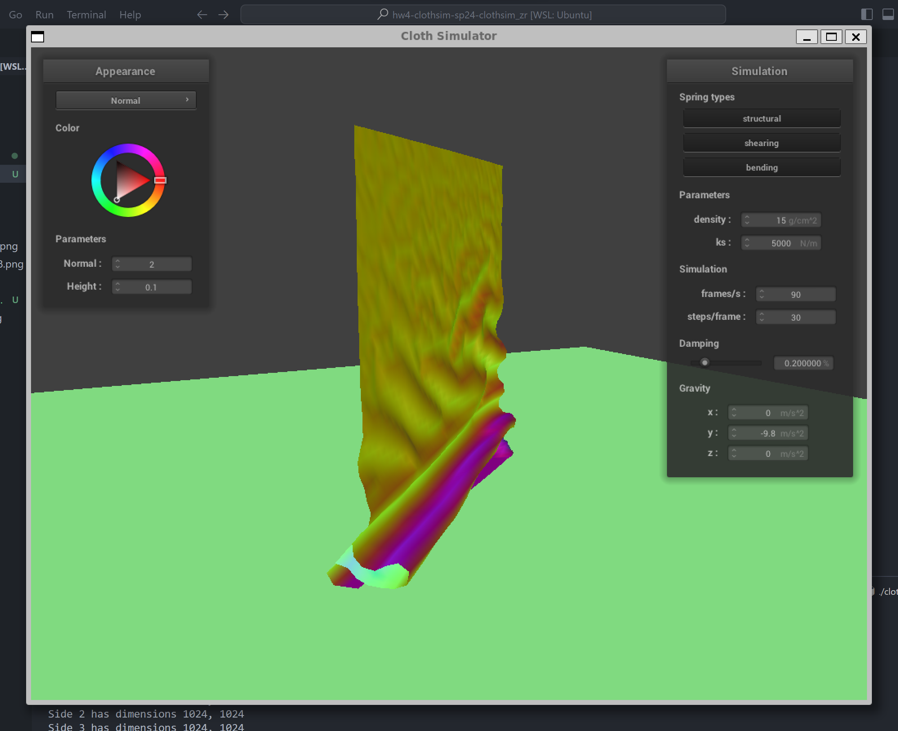
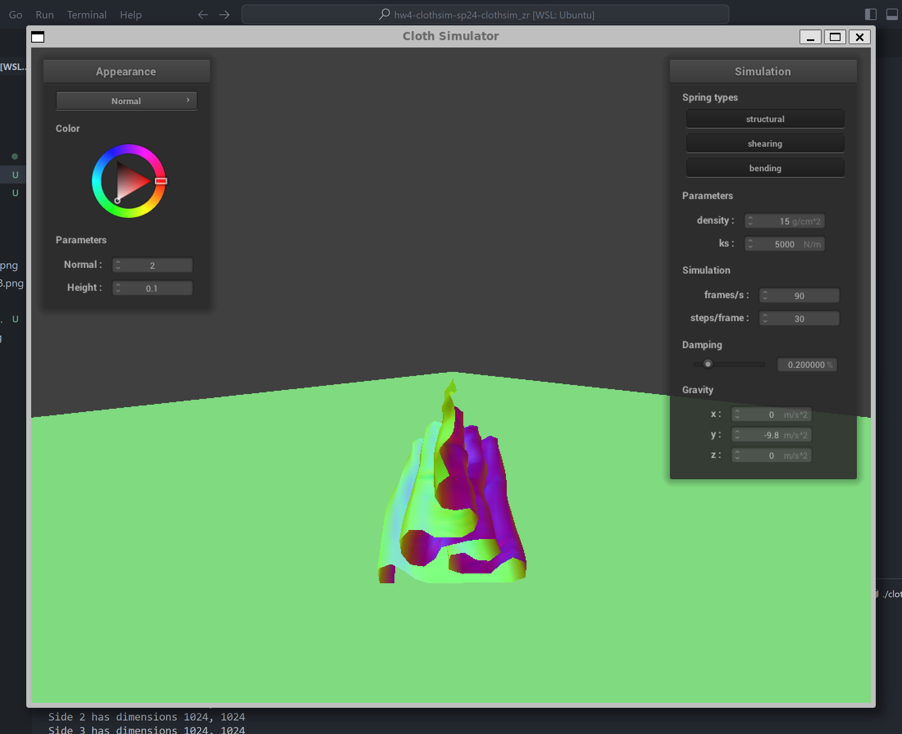
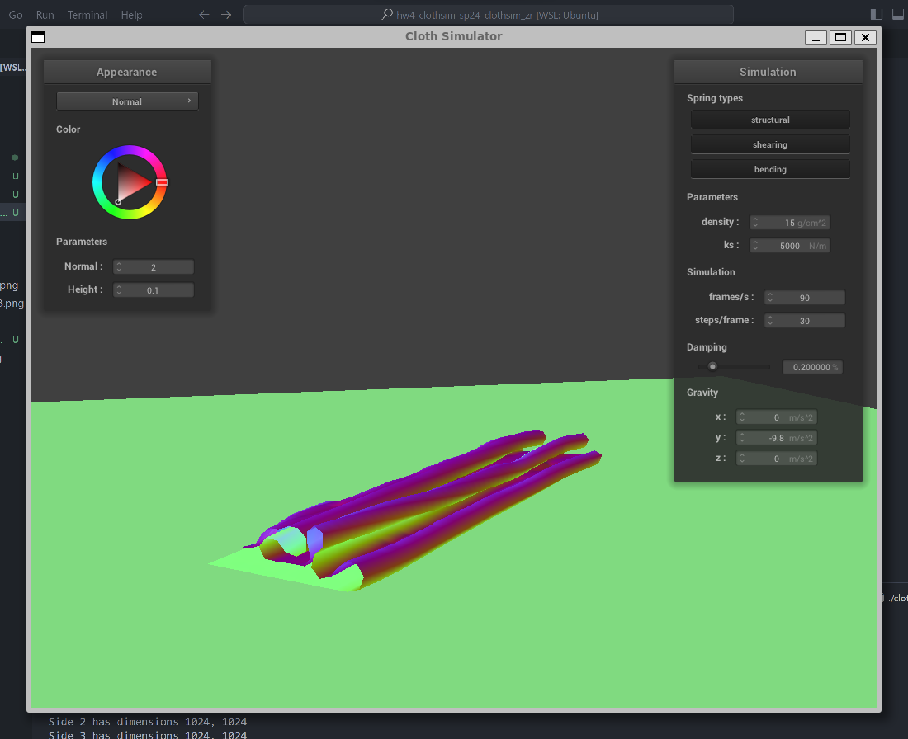

# Part4: Handling self-collisions

## Implementation

To generate a hash value for each point mass, we partitioned the space according to the instructions. To make the hash value unique, we scale the coordinate in each dimension by a factor that is larger than the maximum partition number of all dimensions. The space is partitioned by $w * h * t$, where $t = max(w,h)$, so the multiplication factor is $t$. The hash value is calculated as follows:

```cpp
  // compute a unique float identifier
  return box_position.x * t * t + box_position.y * t + box_position.z;
```

Besides choosing the float identifier, the rest process of handling self-collisions is the same as the instruction.

## Results

The following images show the result at default parameters:

{ width=49% }
{ width=49% }
{ width=49% }
{ width=49% }

Then we tested the simulation with different densities and spring constant.

??? warning "Note for PDF"
    The following GIFs may not be displayed correctly in the PDF version. We recommend reading the [website](https://cal-cs184-student.github.io/hw-webpages-sp24-RuhaoT) directly for the best experience.

**Density = 150, ks = 5000 & Density = 1.5, ks = 5000**

{ width=49% }
{ width=49% }

**Density = 15, ks = 50000 & Density = 15, ks = 500**

{ width=49% }
{ width=49% }

**Density = 150, ks = 50000 & Density = 1.5, ks = 500**

{ width=49% }
{ width=49% }

By varying the density and the spring constant the following effects can be observed:

- **Density**: When density is particularly high, the cloth looks squished and the space between layers of cloth is very small, compared to the normal setting. When density is very low, the spring force will cause the cloth to vibrate significantly.
- **Spring Constant**: When the spring constant is high, the internal force causes the cloth to vibrate significantly, quite similar to the effect of low density. When the spring constant is low, the cloth looks weaker to bend, and the space between layers of cloth is also smaller.
- **Total effect**: It is noticeable that as long as the multiplier of density and spring constant remains the same, the cloth will have similar behavior. For example, when the density is 150 and the spring constant is 5000, the cloth behaves similarly to when the density is 1.5 and the spring constant is 5000.