# Part5: Shaders

## Task 1: Shader program overview

Shader programs execute on the GPU, run in parallel, and are written in GLSL in this assignment. These programs cover several parts of the graphic pipeline. In this assignment, two types of shaders are used: vertex and fragment shaders. The vertex shader is responsible for transforming the vertices of the object, while the fragment shader is responsible for coloring the pixels of the object.

The vertex shader takes the vertex position, normal, and texture coordinates as input and transforms the vertex position to the screen space. It may also change the normal and texture coordinates to achieve different effects, such as bump mapping. The processed information will be passed to the fragment shader for further processing.

The fragment shader takes the interpolated vertex position, normal, and texture coordinates as input and colors the pixel based on the lighting model and texture mapping. It will be automatically linked to the corresponding vertex shader program if there is one. Together, these two shaders form a shader program that renders objects will different materials and lighting effects.
 
This flowchart shows the general process of the shader program:
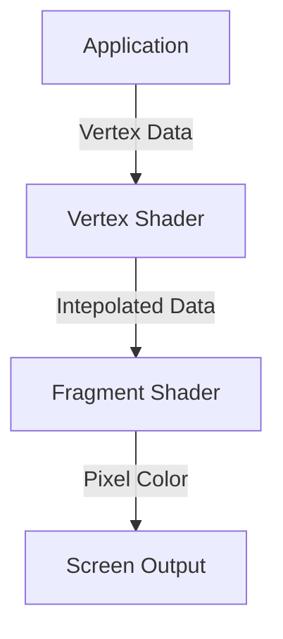

## Task 2: Bling Phong Shading

### Methodology
In this part, we implement the Bling Phong shading model in the fragment shader. The Bling Phong shading model consists of three components: ambient, diffuse, and specular. 

$$
L = L_\text{ambient} + L_\text{diffuse} + L_\text{specular}
$$

The ambient component is the light that is reflected by the object from the environment. Bling-Phong shading assumes that the ambient light is constant for each part of the object. The ambient component is calculated by multiplying the ambient coefficient, i.e., how much ambient light is reflected, with the ambient light intensity:

$$
L_\text{ambient} = k_\text{ambient} \cdot I_\text{ambient}
$$

The diffuse component is the diffuse reflection of the object. It is equal to the total irradiance arriving at the surface. Given the radiosity $I$ of the light source at unit distance, the radiosity of the light source at distance $r$ is $I/r^2$. However, according to Lambert's cosine law, the irradiance is proportional to the cosine of the angle between the light source and the normal of the object. Therefore, the diffuse component is calculated as follows:

$$
L_\text{diffuse} = k_\text{diffuse} \cdot \left(I / r^2 \right) \cdot \max(0, \vec{L} \cdot \vec{N})
$$

The specular component is the specular reflection of the object. Specular reflection can only be observed within a certain range of angles. In Bling-Phong shading, a half-vector is used to calculate the specular reflection. The half-vector is the vector that bisects the angle between the light source direction $\vec{l}$ and the eye direction $\vec{v}$. The angle between the half-vector and the normal vector $\vec{n}$ is used to calculate the degradation of the specular reflection:

$$
cos(\theta)^{p} = \frac{\vec{h} \cdot \vec{n}}{\left\| \vec{h} \right\| \cdot \left\| \vec{n} \right\|}
$$

Where $p$ is the shininess coefficient. The specular component is calculated as follows:

$$
L_\text{specular} = k_\text{specular} \cdot I \cdot \max(0, cos(\theta))^p
$$

By adjusting the ambient, diffuse, and specular coefficients, different materials can be simulated.

### Implementation

In our implementation, we manually choose a set of Bling-Phong shading parameters as follows:

```cpp
  // define ka, kd, ks, la, and p
  float ka = 0.1; // Ambient reflection coefficient
  float kd = 0.8; // Diffuse reflection coefficient
  float ks = 0.5; // Specular reflection coefficient
  vec3 la = vec3(1.0, 1.0, 1.0); // Ambient light intensity
  float p = 32.0; // Shininess
```

First, the output is initialized as a zero vector and the ambient, diffuse and specular component is added, respectively:

```cpp
  out_color.xyz = vec3(0.0, 0.0, 0.0);

  // ambient reflection
  out_color.xyz += ka * la;

  // diffuse reflection
  float r = length(u_light_pos - v_position.xyz);
  vec3 l = normalize(u_light_pos - v_position.xyz);
  vec3 n = normalize(v_normal.xyz);
  out_color.xyz += kd * u_light_intensity / (r * r) * max(dot(n, l), 0.0);

  // specular reflection
  vec3 v = normalize(u_cam_pos - v_position.xyz);
  vec3 h = normalize(l + v);
  out_color.xyz += ks * u_light_intensity / (r * r) * pow(max(dot(n, h), 0.0), p);
  
  out_color.a = 1;
```

### Results

The following images show the result of Bling Phong shading with ambient only, diffuse only, specular only, and all components combined.

**Ambient Only and Diffuse Only**

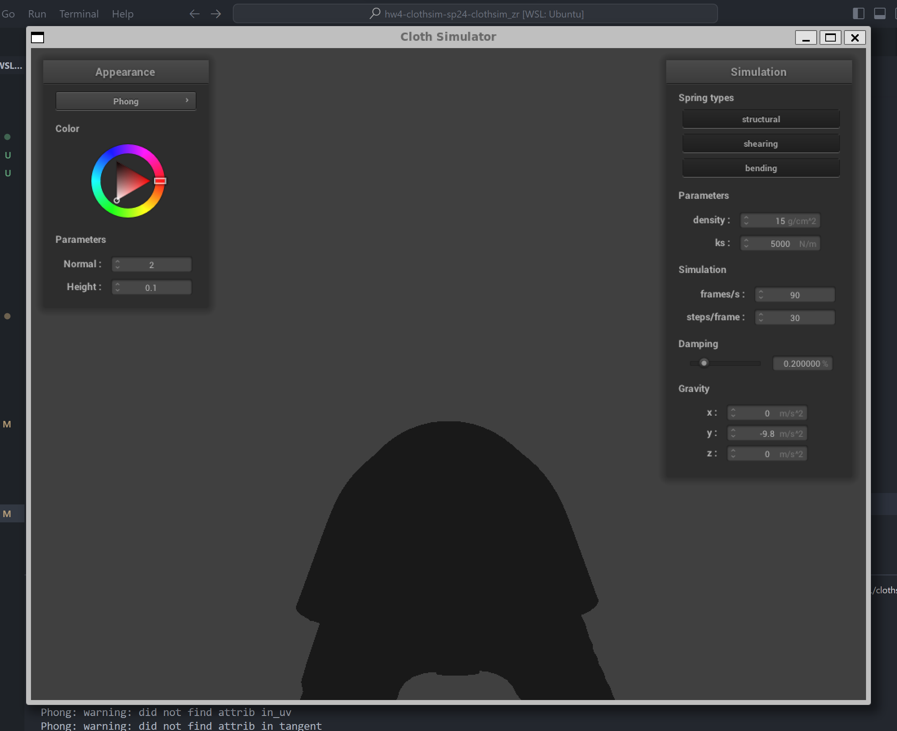{ width=49% }
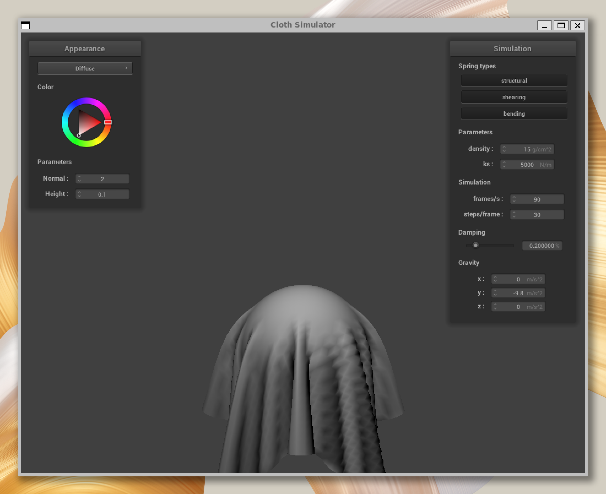{ width=49% }

**Specular Only and All Components**

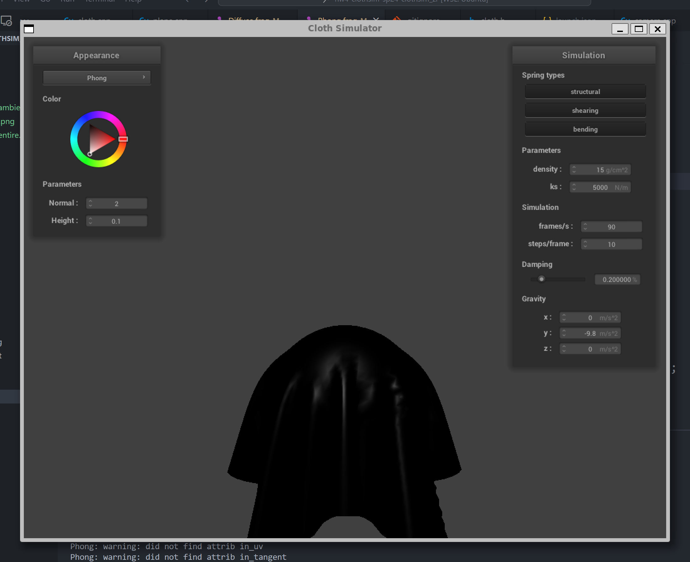{ width=49% }
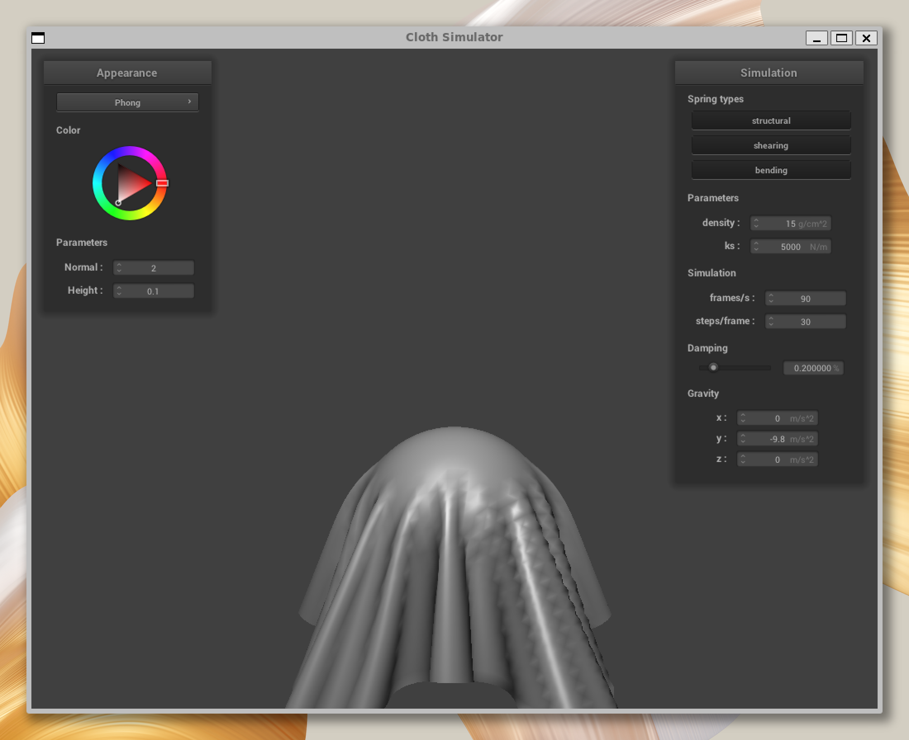{ width=49% }

## Task 3: Texture Mapping

In this part, we implement texture mapping in the fragment shader:

```cpp
  out_color = texture(u_texture_1, v_uv);
```

The texture is replaced by an image downloaded from Berkeley Reddit:

{ width=49% }

The following image shows the result of texture mapping:

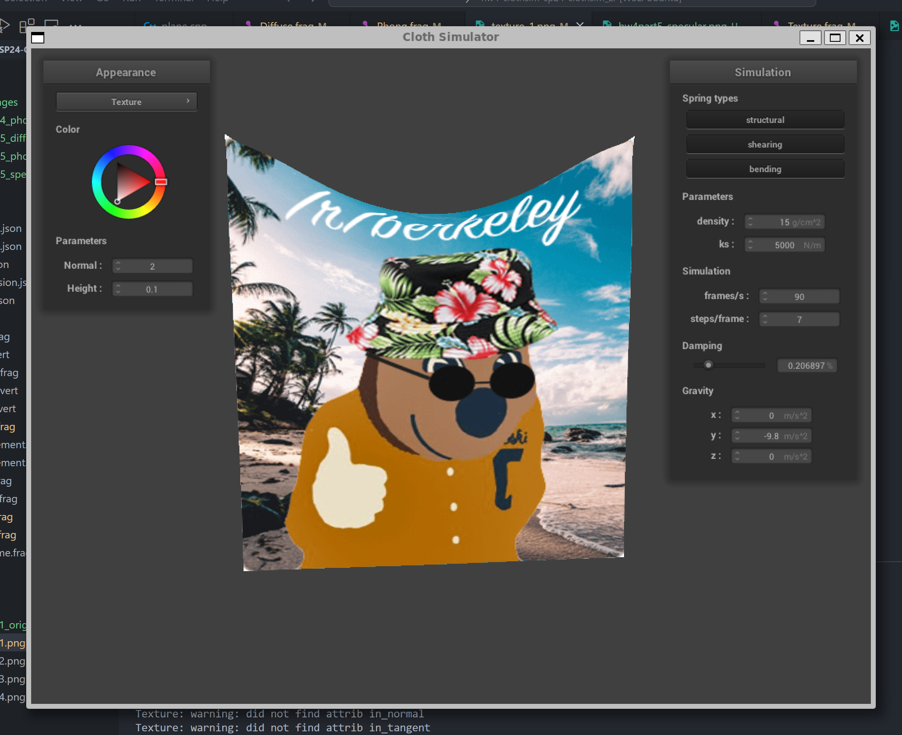

## Task 4: Bump Mapping and Displacement Mapping

### Implementation of Bump Mapping

In this section, we implemented Bump Mapping in the fragment shader by sampling a chosen height map. 

First, a local space disturbance vector is created by sampling the height map:

```cpp
  // calculate dU, dV
  float dU = (h(vec2(v_uv.x + 1.0 / u_texture_2_size.x, v_uv.y)) - h(v_uv)) * u_normal_scaling * u_height_scaling;
  float dV = (h(vec2(v_uv.x, v_uv.y + 1.0 / u_texture_2_size.y)) - h(v_uv)) * u_normal_scaling * u_height_scaling;

  // calculate local space normal
  vec3 n0 = vec3(-dU, -dV, 1.0);
```

Then, a $TBN$ matrix is created ahead of time to convert local space vectors to object space:

```cpp
  // calculate local space tangent
  vec3 t = v_tangent.xyz;

  // calculate local space bitangent
  vec3 n = v_normal.xyz;
  vec3 b = cross(n, t);

  // calculate TBN matrix
  mat3 TBN = mat3(t, b, n);
```

Finally, the normal is transformed from local space to object space:

```cpp
  // calculate normal in world space
  vec3 nd = TBN * n0;
```

This normal is then used in the Bling Phong shading model to calculate the final color.

### Implementation of Displacement Mapping

Different from Bump Mapping, in displacement mapping the coordinates of the input vector is also modified in the vertex shader:

```cpp
  v_position = u_model * in_position + v_normal * h(v_uv) * u_height_scaling;
```

Where $h(v_uv)$ is the height map function. The vertex position is moved along the normal direction by the height map value.

### Results

A height map from Wikipedia is used in this part:

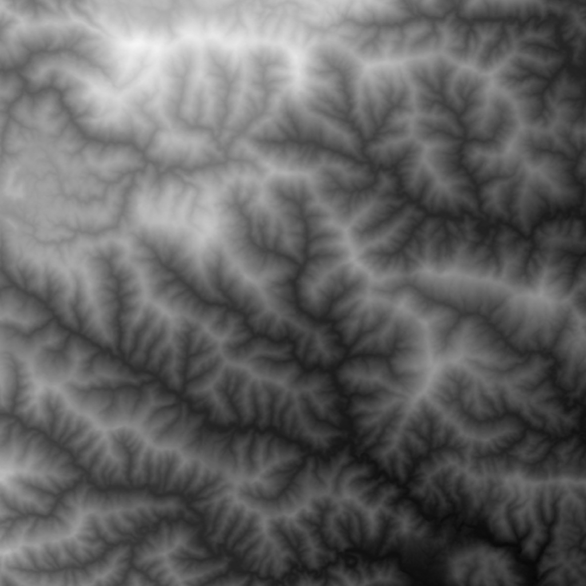{ width=49% }

The following images show the result of bump mapping and displacement mapping:

**Bump Mapping with Coarseness 16 and 128**

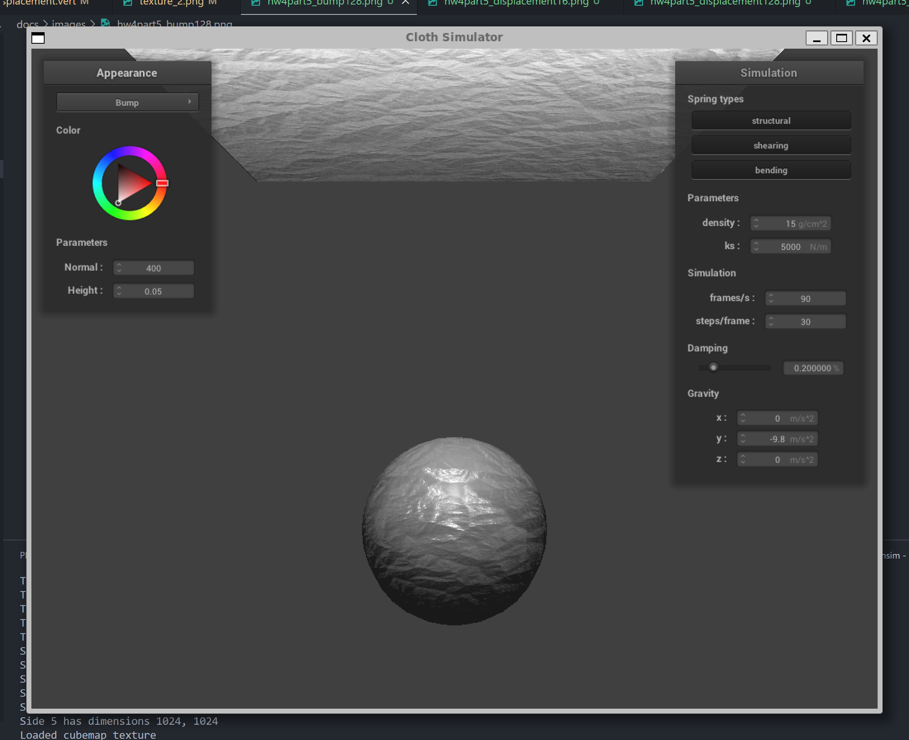{ width=49% }
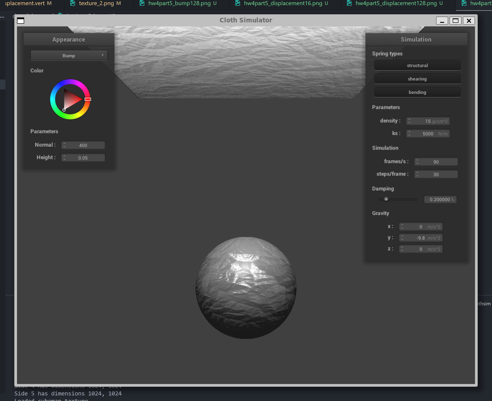{ width=49% }

**Displacement Mapping with Coarseness 16 and 128**

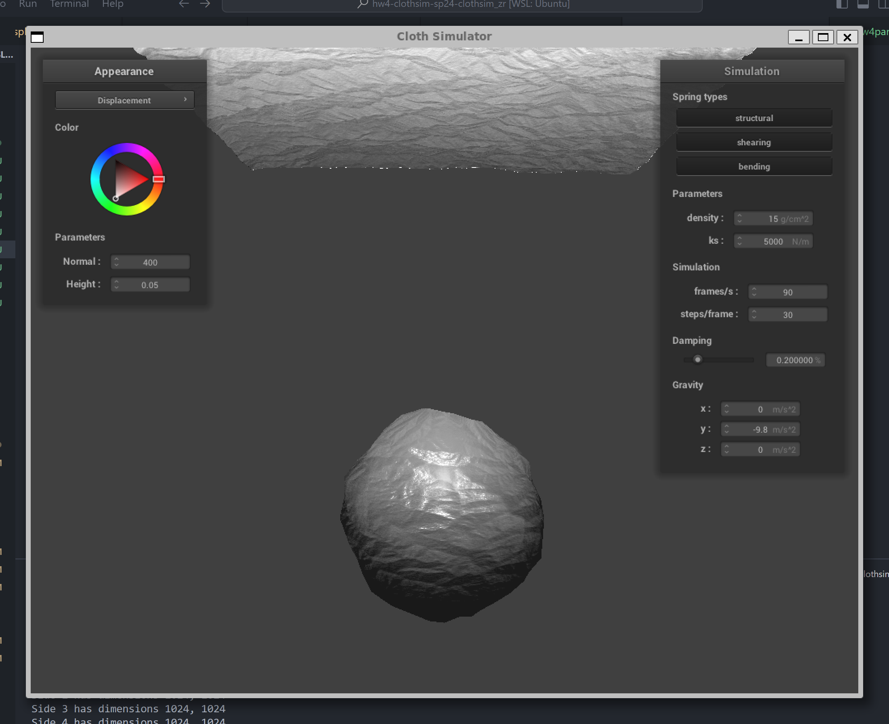{ width=49% }
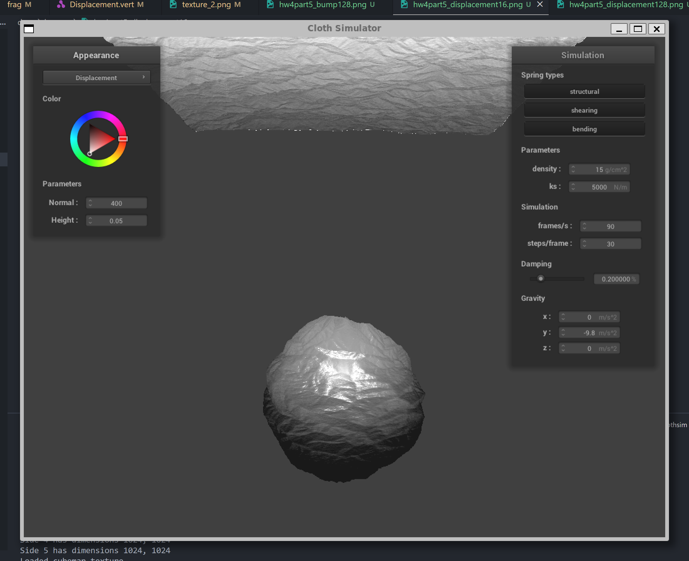{ width=49% }

According to the figures, the sphere with bump mapping has a smooth round shape despite the rough surface caused by the height map. Different from bump mapping, the sphere with displacement mapping has a rough surface and the shape is distorted. This is because the vertex position is modified in the vertex shader, which changes the shape of the object.

Coarseness also affects the result of bump mapping and displacement mapping. The results with less coarseness have more concentrated and brighter specular reflections, while the highlights are more diffused with more coarseness.

## Task 5: Environment Mapping

### Methodology and Implementation
In this part, we simulate mirror reflection by casting a ray from the camera position to the object and then reflecting it to the environment map.

Given the camera position and fragment position, the eye ray direction is calculated as follows:
```cpp
  // Calculate the eye ray direction
  vec3 eye_ray_dir = normalize(v_position.xyz - u_cam_pos);
```

The reflected ray direction is calculated with the help of object normal:
```cpp
  // Calculate the reflection direction
  vec3 reflection_dir = reflect(eye_ray_dir, normalize(v_normal.xyz));
```

Finally, the environmental map is sampled with the same technique in previous tasks:
```cpp
  // sample the environment map
  out_color = texture(u_texture_cubemap, reflection_dir);

  out_color.a = 1;
```

### Results
The image below shows the result of environment mapping. The object is a sphere with a mirror reflection. The environment map is a skybox with a mountain view.

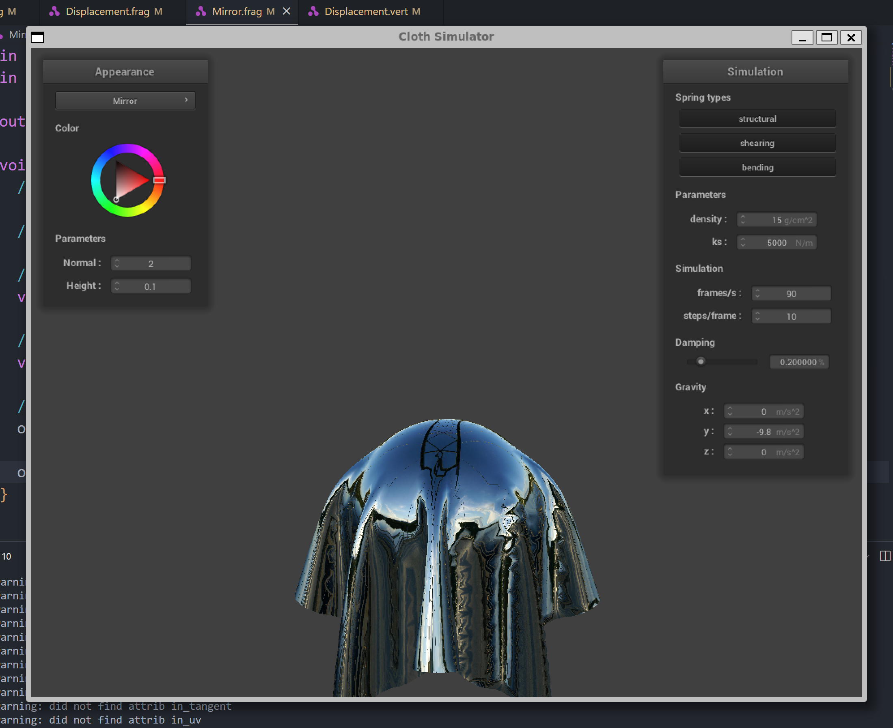